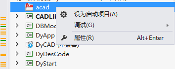
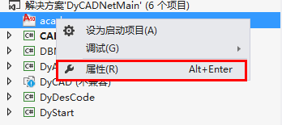
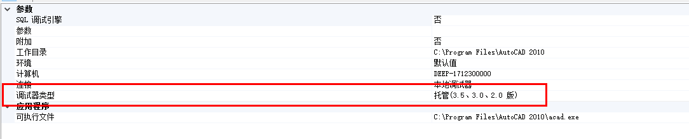

最近被公司分配到了做CAD二次开发。也是初次接触这方面的东西，其实是有些无从下手的感觉。因为公司这边也没有人有时间带我，只能是自己看书，然后再写一些Demo，再结合实际的应用来一点点的学习。废话不多说，推荐一本我入门的书籍，就是李冠亿先生的《深居浅出AutoCAD二次开发》,写的非常不错，把这本书中的Demo自己手写一遍大概就能知道CAD二次开发到底是个什么东西了。

# 开发环境配置
## 开发环境
- Win10 x64
- CAD 2010
- Visual Studio 2012

## 环境配置
1. 首先要安装CAD软件
2. 用Visual Studio新建一个类库项目。
3. 需要添加常用的引用，在CAD目录下，下面介绍三个主要的DLL文件
- AcDbMgd.dll 当处理图形文件中存储对象时引用。
- AcMgd.dll 当处理AutoCAD应用程序和用户接口时引用。
- AcGui.dll 当处理自定义文件时引用。

# 程序与调试
## 写第一个程序
1. 在刚刚创建的类库中添加一个类
```
public class FisrtCADTest
{
    [CommandMethod("Hello")]
    public void Hello
    {
        Document acDoc = Application.DocumentManager.MdiActiveDocument;
        Editor ed = acDoc.Editor;
        ed.WriteMessage("Hello World！");
    }
}
```
2. 编译这个程序
3. 启动CAD在命令行中输入netload,然后在打开的窗口中找到刚编译的程序的dll,加载后在命令行输入Hello，猜猜会出现什么？没错，你的第一个CAD二次开发的程序已经完美运行了。

## 如何调试程序
书中介绍了一种方法，不再赘述，下面来说一下我常用的方法
在解决方案资源管理器中右击解决方案，选择“添加”-“现有项目”

在打开的对话框中找到CAD安装路径下的acad.exe,选择打开

将刚添加的项目设置为启动项目

设置项目属性

修改调试器类型如下图所示

在需要的地方设置断点，启动项目，会发现CAD程序会被找开，netload加载程序集，就可以调试啦

