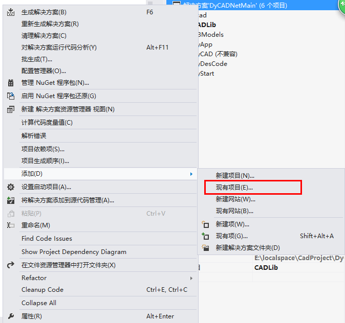
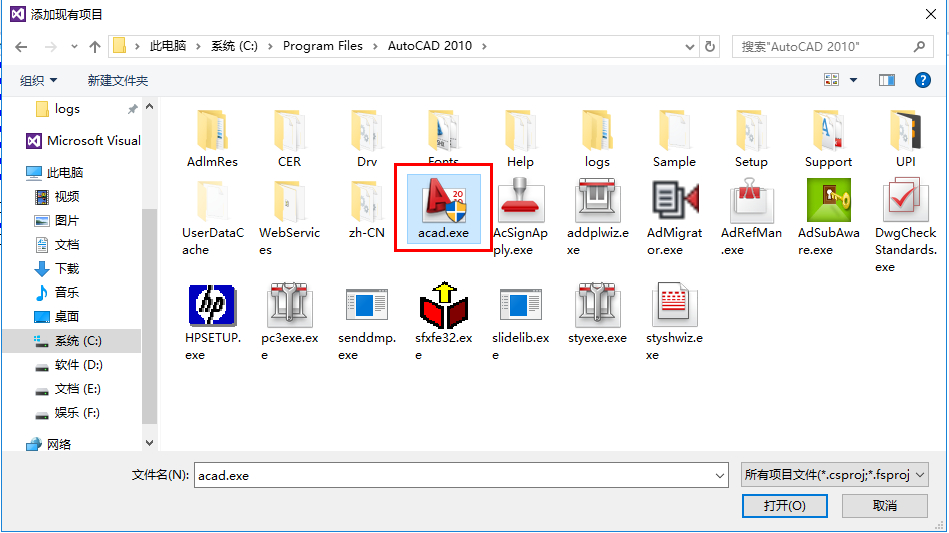

最近被公司分配到了做CAD二次开发。也是初次接触这方面的东西，其实是有些无从下手的感觉。因为公司这边也没有人有时间带我，只能是自己看书，然后再写一些Demo，再结合实际的应用来一点点的学习。废话不多说，推荐一本我入门的书籍，就是李冠亿先生的《深居浅出AutoCAD二次开发》,写的非常不错，把这本书中的Demo自己手写一遍大概就能知道CAD二次开发到底是个什么东西了。

# 1. 开发环境配置

## 1.1. 开发环境

- Win10 x64
- CAD 2010
- Visual Studio 2012

## 1.2. 环境配置

1. 首先要安装CAD软件
2. 用Visual Studio新建一个类库项目。
3. 需要添加常用的引用，在CAD目录下，下面介绍三个主要的DLL文件
- AcDbMgd.dll 当处理图形文件中存储对象时引用。
- AcMgd.dll 当处理AutoCAD应用程序和用户接口时引用。
- AcGui.dll 当处理自定义文件时引用。

# 2. 程序与调试

## 2.1. 写第一个程序

1. 在刚刚创建的类库中添加一个类

```C#
public class FisrtCADTest
{
    [CommandMethod("Hello")]
    public void Hello
    {
        Document acDoc = Application.DocumentManager.MdiActiveDocument;
        Editor ed = acDoc.Editor;
        ed.WriteMessage("Hello World！");
    }
}
```

1. 编译这个程序
2. 启动CAD在命令行中输入netload,然后在打开的窗口中找到刚编译的程序的dll,加载后在命令行输入Hello，猜猜会出现什么？没错，你的第一个CAD二次开发的程序已经完美运行了。

## 2.2. 如何调试程序

书中介绍了一种方法，不再赘述，下面来说一下我常用的方法
在解决方案资源管理器中右击解决方案，选择“添加”-“现有项目”

在打开的对话框中找到CAD安装路径下的acad.exe,选择打开

将刚添加的项目设置为启动项目

设置项目属性

修改调试器类型如下图所示

在需要的地方设置断点，启动项目，会发现CAD程序会被找开，netload加载程序集，就可以调试啦

# 3. 错误记录

1、CAD崩溃，错误“unhandled access violation reading”=“未将对象引用设置到对象的实例”。

2、建模操作错误:指向给定边的指针为空。
建模操作错误:访问冲突。
acdbmgdeGeneralModelingFailure

- 情形一

这类错误是CAD直接在其命令行中输出提示的，有时候会引发CAD崩溃，但有时候又不会引发崩溃。

我碰到的这种类错误的情况是：频繁对一些Region进行重复炸碎，出现了这类错误。重复时间间隔越短越容易出问题，有时候中间间隔十几秒半分钟，但还会引发这类错误。

原因可能是炸碎之后对象的释放不及时，CAD内存管理上出了问题；炸碎之后的实体存放在了DBObjectCollection中，虽然这个类的继承了IDisopsable，并且实现了Dispose方法和析构函数，但C#对它的释放时机好像没有把握对，释放的太晚，可能我第一次炸碎之后的得到的对象，在我第二次进行炸碎操作的时候还没有释放掉，或者在炸碎的过程中进行了释放，于是出错误。

而对于释放不及时的原因，我猜想是因为DBObjectCollection内部有些地方用了GC.KeepAlive，而使得C#对它的释放不够及时。

解决的办法是尽量手动释放，发现这个问题之后，我刚开始是在使用完炸碎Region得到的DBObjectCollection之后，进行了统一的释放，但是还会出现这类错误。于是在使用DBObjectCollection的循环内部，每次循环结束后，主动调用每个DBObject的Dispose方法，然后在循环结束之后，再对DBObjectCollection进行统一释放，至此，没有再出现这类错误。

- 情形二

注意foreach循环

3、不会命中断点，源代码与原始版本不同。

在时候用VS调试代码的时候设的断点无效，断点上会出来一个黄色的三角形，鼠标放上去会提示“不会命中断点，源代码与原始版本不同”，出现这种情况可以把项目中bin文件夹和obj文件夹清空，然后再重新生成解决方案。如果不能解决，可以找到工具->选项->调试->要求源文件与原始版本完成匹配，去掉勾选。

4、eNonCoplanarGeometry

当实体不共面时，即有些实体的Z值不为0，则进行想到计算、判断时（如面域的布尔运算），会有此提示，此时把对应实体或所有实体的Z值全部清零即可，或者是在进行计算、判断前先判断每个参与操作的实体的Z值是否为0，如果不为0则跳过不进行运算。

5、eNotApplicable

情况1：一个面域是复合面域，是一个回字形面域，但它里面的那一块非常非常小，此时将它炸开时会失败（不管是用接口的炸开还是用CAD命令炸开都会失败）。

# 4. CommandFlags

枚举值|描述
ActionMacro|可以用动作录制器录制命令动作；
DocReadLock|命令执行时将被只读锁定；
Interruptible|提示用户输入时可以中断命令；
Modal|别的命令运行时不能运行此命令；
NoActionRecording|不能用动作录制器录制命令动作；
NoBlockEditor|不能从块编辑器使用该命令；
NoHistory|不能将命令添加到repeat-last-command（重复上一个命令）历史列表；
NoPaperSpace|不能从图纸空间使用该命令；
NoTileMode|当TILEMODE置1时不能使用该命令；
NoUndoMarker|命令不支持撤销标记。用于不修改数据库因而也就无需出现在撤销记录中的那些命令；
Redraw|不清空取回的先选择后执行设置及对象捕捉设置；
Session|命令运行于应用程序上下文，而不是当前图形文档上下文；
Transparent|别的命令运行时可以运行此命令；
Undefined|只能通过全局名使用命令；
UsePickSet|清空取回的先选择后执行设置；
