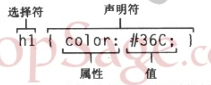
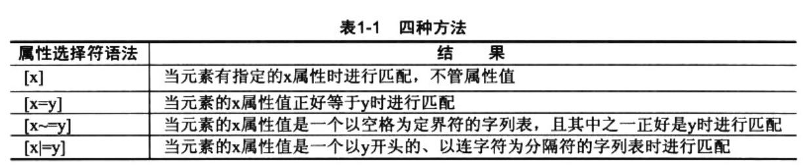
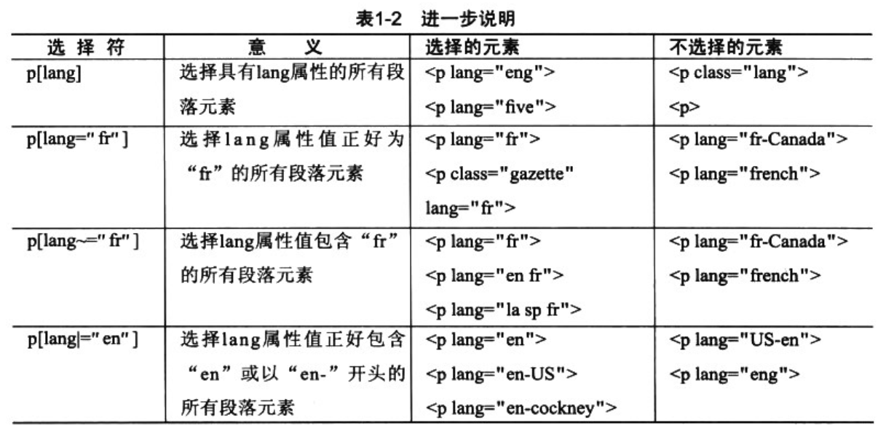
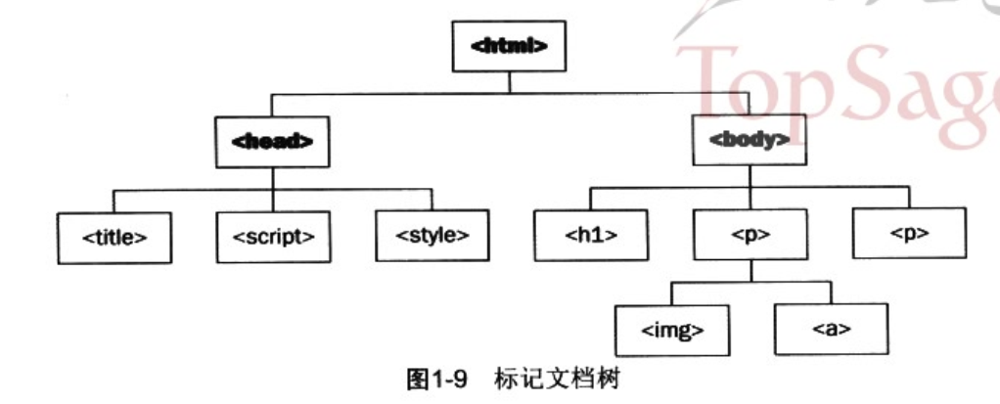
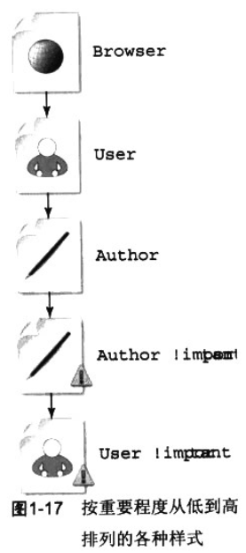
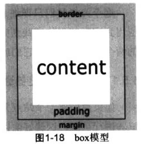

# 1. 有关 XHTML 和 CSS 的最佳实例

## 1.1. 把结构和表现标记硬挤到一起

## 1.2. 学习并热衷于使用标记

### 1.2.1. XHTML：新热点

HTML 有块级元素(如div、p、table等)和内联元素(如a、em、strong等)之分，内联元素永远不能包含块级元素。

XHTML 特点

- DOCTYPE 声明
- 保持标记具有良好的架构
- 关闭每一个元素
- 把元素和属性值设置为小写
- 必须为每个属性指定一个值

### 1.2.2. 从结构提取样式

## 1.3. CSS:添加样式层

### 1.3.1. 更好的了解选择符



- 1.类型选择符

```css
h1 {
color:#36C;
}
```

- 2.通配选择符

```css
* {
color:#000;
}
```

- 3.后代选择符

```css
ul em {
text-transform:uppercase;
}
```

- 4.类选择符

```css
.text {
    border:1px solid :#C00;
}
```

- 5.id选择符

```css
h1 #page-title {
    text-align:right;
}
```

### 1.3.2. 其他选择符

- 1.子选择符

```css
body>p {
    font-weight:bold;
}
```

大于符号 &gt; 指示用户代理选择子一级的所有 p 元素而不是所有后代。

- 2.属性选择符





### 1.3.3. 多重声明组合

### 1.3.4. 对选择符进行分组

### 1.3.5. 继承



- 1.检查元素的层次

不是氖属性都可以继承，外边距和内边距就是两个例外。这些属性只能单独应用于某个元素，而不能被其后代继承。

- 2.重写继承

### 1.3.6. 综合应用

## 1.4. 了解层叠

### 1.4.1. 探寻样式来源

样式表三个方面来源

- 用户代理
- 用户
- 作者



### 1.4.2. 根据优先级排序

## 把理论应用于实践

### 基于可靠浏览器进行构建

CSS hack：基于不同浏览器写不同CSS代码的过程

### 理性对待 hack



# Google 的 blogger.com 翻转器和设计思想

## 设计人员访谈

## CSS 驱动的翻转器

### 改变链接的颜色和背景色（简单）

```html
<style>
a {
    border-bottom: 1px solid #eee;
    color: #d17e62;
    text-decoration: none;
}

a:visited {
    border-bottom: 1px solid #eee;
    color: #09d604c;
    text-decoration: none;
}

a:hover {
    background-color: #ffffda;
    border-bottom: 1px solid #ddd;
    color: #c30;
    text-decoration: none;
}
</style>

<p>If you're interested then<a href="">bung me an email</a> and we can talk about what you want</p>

```

### 改变链接的颜色和背景色（复杂）


