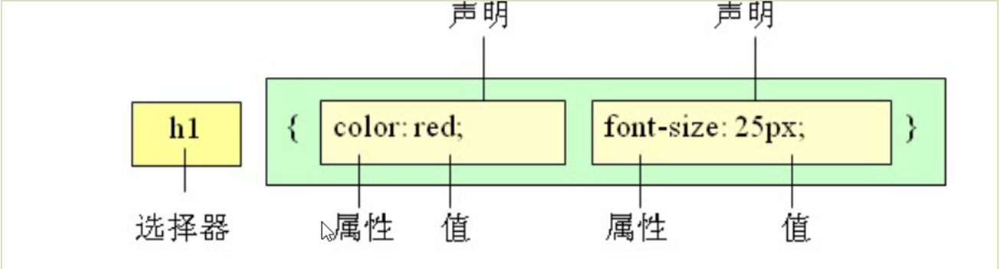
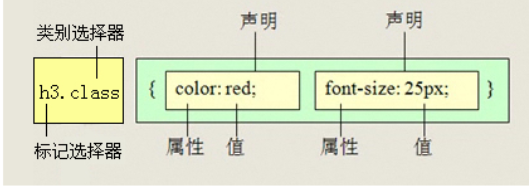
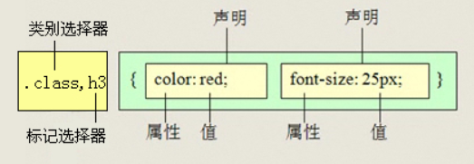
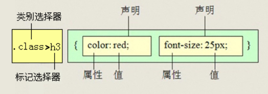

# 1. CSS 样式规则



# 2. 字体设置

## 2.1. 字体综合设置

```css
选择器 {font: font-style font-weight font-size/line-weight font-family;}

```

注意：

- 顺序不能变.
  
- 不需要设置的属性可以省略，取默认值，但必须保留 font-size 与 font-family

## 2.2. input提示

```html
<input type="text" placeholder="请输入内容"/> 
```

# 3. 选择器

## 3.1. 标签选择器（元素选择器）

```css
标签名 { 属性1:属性值1;属性2：属性值2}
```

## 3.2. 类选择器

```css
.类名 {属性1:属性值1;属性2：属性值2}
```

## 3.3. id 选择器

```css
#id名 {属性1:属性值1;属性2：属性值2}
```

id 选择器与 类选择器的区别：在使用次数上，类选择器可以使用多次，id 选择器只能使用一次

## 3.4. 通配符选择器

```css
* {属性1:属性值1;属性2：属性值2}
```

## 3.5. 伪类选择器

### 3.5.1. 链接伪类选择器

- :link  未访问的链接
- :visited 已访问的链接
- :hover 鼠标移动到链接上
- :active 选定的链接，选定不松开时

注意：顺序不能颠倒

### 3.5.2. 结构伪类选择器

- :first-child 选取属于其父元素的首个子元素的指定选择器
- :last-child 选取属于其父元素的最后一个子元素的指定选择器
- :nth-child(n)  选取第n个,n从0开始,n可以是公式
- :nth-last-child(n) 从最后一个元素开始,

### 3.5.3. 目标伪类选择器

:target 目标伪类选择器，选择器可用于选取当前活动的目标元素。

# 4. 文字

## 4.1. 文字阴影

```css
text-shadow: 水平位置，垂直位置，模糊距离，阴影颜色
```

## 4.2. 文本的装饰

值|描述
-|-|
none|默认，定义标准的文本
underline|定义文本下的一条线
overline|定义文本上的一条线
line-through|定义穿过文本下的一条线

# 5. css样式表

样式表|优点|缺点|使用情况|控制范围|
-|-|-|-|-|
内部样式表|书写方便，权重高|没有实现样式和结构相分离|较少|控制一个标签（少） 
行内样式表|部分结构与样式分离|没有彻底分离|较多|控制一个页面（中）
外部样式表|完全实现结构与样式分离|需要引入|最多，强烈推荐|控制整个站点（多）

## 5.1. 标签的显示形式

HTML 标签一般分为块标签和行内标签两种类型，它们也称块元素和行内元素

### 5.1.1. 块级元素

每个块级元素通常都会独自占据一整行或多行，可以对其设置宽度、高度、对齐等属性，常用于网页布局和网页结构搭建。

常见的元素有：

```css
<h1>...<h6>、<p>、<div>、<ul>、<ol>、<li>等
```

特点：

- 总是从新行开始
- 宽度、行高、外边距及内边距都可以控制
- 宽度默认是容器的100%
- 可以容纳其它内联元素和其他块元素

### 5.1.2. 行内元素

行内元素（内联元素）不占有独立的区域，仅仅靠自身的字体大小和图像尺寸来支撑结构，一般不可以设置宽度、高度、对齐等属性，常用开控制页面中文本的样式。

常见的行内元素有

```css
<a> <strong> <b> <em> <i> <del> <ins> <u> <span>
```

特点：

- 和相邻行内元素在一行内显示
- 高、宽无效，但水平方向的 padding 和 margin 可以设置，垂直方向的无效。
- 默认宽度就是它本身内容的宽度
- 行内元素只能容纳文本或者其他行内元素（a特殊)

注意：

- 只有文字能组成段落，因此 p 里面不能放块级元素，同理 h1~h6
- 链接里面不能再放链接

### 5.1.3. 行内块元素(inline-block)

在行内元素中有几个特殊的标签 &lt;img/&gt;、&lt;input/&gt;、&lt;td&gt; 可以对它们设置宽度和对齐属性

特点：

- 和相邻行内元素（行内块）在一行上，但是之间会有空白缝隙。
- 默认宽度就是它本身内容的宽度（宽度由内容决定）
- 高度，行高，外边距以及内边距都可以控制。

### 5.1.4. 显示模式转换

块转行内： display:inline;
行内转块： display:block;
块、行内元素转行内块： display:inline-block;

# 6. 复合选择器

## 6.1. 交集选择器



## 6.2. 并集选择器



## 6.3. 后代选择器


## 6.4. 子元素选择器



## 6.5. 属性选择器

选取标签带有某些特殊属性的选择器

选择器|含义|
-|-|
E[attr] | 存在 attr 属性即可
E[attr=val]|属性值完全等于 val
E[attr*=val]|属性值包含 val 字符并且在“任意”位置
E[attr^=val]|属性值包含 val 字符并且在“开始”位置
E[attr$=val]|属性值包含 val 字符并且在“结束”位置

## 6.6. 伪元素选择器（CSS3)

- E::first-letter 文本的第一个单词或字
- E::first-line 文本第一行
- E::selection 可改变选中文本的样式
- E::before和 E::after 在E元素内部开始的位置和结束位创建一个元素，该元素为行内元素，且必须结合content属性使用

### before和after伪元素（详解）

伪元素 before 和 after 添加的内容默认是 inline元素，必须设置content 属性
伪元素是不占位置的。


# 7. CSS 书写规范

## 7.1. 空格规范

【强制】选择器与{}之间必须包含空格
【强制】属性名与之后的：之间不允许包含空格，：与属性值之间必须包含空格.
示例：

```css
font-size: 12px;
```

## 7.2. 选择器规范

【强制】当一个 rule 包含多个 selector 时，每个选择器声明必须独占一行。
【建议】选择器嵌套层级不大于3级，位置靠后的限定条件应尽可能精确。

## 7.3. 属性规范

【强制】属性定义必须另起一行
【强制】属性定义后必须以分号结尾

# 8. CSS 背景

## 8.1. 多背景

- 一个元素可以设置多重背景图像
- 每组属性之间使用逗号隔开
- 如果设置的多重背景之间存在着交集（即存在着重叠关系），前面的背景图片会覆盖在后面的背景图片上。
- 为了避免背景色将图像盖住，背景色通常定义在最后一组上。

# 9. CSS 三大特性

## 9.1. 层叠性

样式冲突遵循的原则是就近原则，哪个样式离着结构近就执行哪个样式。

## 9.2. 继承性

子元素可以继承父元素的样式，如 text- font- line- 以及 color属性

## 9.3. 优先性

权重表

继承或者*的贡献值|0,0,0,0
-|-|
每个元素（标签）贡献值为|0,0,0,1
每个类、伪类贡献值为|0,0,1,0
每个ID贡献值为|0,１,0,0
每个行内样式贡献值为|1,0,0,0
每个!important贡献值为|无穷大

继承的权重为0

# 10. 盒子模型

## 10.1. 外边距合并

### 10.1.1. 相邻元素块垂直外边距合并

不是两者相加的和，而是取两者中的较大者。

### 10.1.2. 嵌套元素垂直外边距合并

对于两个嵌套关系的块元素，如果父元素没有上边距及边框，则父元素的上边距会与子元素的上边距发生合并，合并后的外边距为两者中的较大者。

解决方案：

- 可以为父元素定义1像素的上边框或上内边距。
- 可以为父元素添加overflow:hidden

## 10.2. 盒子的计算尺寸

注意：

- 宽度属性和高度属性仅适用于块级元素，对行内元素无效（img标签和input除外）
- 计算盒子模型的总高度时，还应考虑上下两个盒子垂直外边距合并的情况
- 如果一个盒子没有给定宽度/高度或者继承父亲的宽度/高度,则padding不会影响本盒子大小。

## 10.3. 盒子模型与布局稳定性

稳定性
width > padding > margin

## 10.4. CSS3 盒模型

1. box-sizing:content-box 盒子大小为 width + padding + border ,此值为默认值，W2C标准的Box Mode
2. box-sizing:border-box 盒子大小为 width

## 10.5. 盒子阴影

```css
box-shadow 水平位置 垂直位置 模糊距离 阴影尺寸 阴影颜色  内外阴影 
```

## 10.6. 浮动

CSS 定位机制有3种：普通流（标准流）、浮动和定位

- 普通流(normal flow) ：自上而下，自左而右
- 浮动：最开始用来做文字环绕效果

### 10.6.1. 什么是浮动

元素浮动是指设置了浮动属性的元素会脱离标准普通流的控制，移动到其父元素中指定位置的过程。

### 10.6.2. 浮动与行内块

行内块之间有难以却除的间隙
行内元素或块级元素添加浮动后变为行内块

## 10.7. 版心和布局流程

- 确定页面的版心
- 分析页面中的行模块，以及每个行模块中的列模块
- 制作HTML结构
- CSS初始化，然后开始运用盒子模型的原理，通过 DIV+CSS布局来控制网页中的各个模块。

### 10.7.1. 清除浮动的本质

清除浮动主要是为了解决父级元素因为子级浮动引起内部高度为0的问题。

清除方法

- 额外标签法：在浮动元素末尾添加一个空的标签，例如 
  
```html
<div style="clear:both"></div>
```
优点：通俗易懂，书写方便
缺点：添加许多无意义的标签，结构化差。

方法|内容（例子）|优点|缺点|
-|-|-|-|
额外标签法|在浮动元素末尾添加一个空的标签，例如：&lt;div style="clear:both"&gt;&lt;/div&gt;|通俗易懂，书写方便|添加许多无意义的标签，结构化差
父级增加overflow属性方法|给父级元素增加overflow为hidden或auto或scroll都可以实现|代码简洁|内容增多时候容易造成不会自动换行导致内容被隐藏掉，无法显示需要溢出的元素
使用after伪元素|.clearfix:after{content:".";display:block;height:0;visibility:hidden;clear:both}|符合闭合浮动思维，结构主义化明确|由于IE6-7不支持after,使用zoom:1触发 hasLayout
双伪元素|.clearfix:before,.clearfix:after{content:"",display:table}  .clearfix:after{clear:both} .clearfix{*zoom:1;}|代码更简洁|由于IE6-7不支持after,使用zoom:1触发 hasLayout

# 11. 定位

## 11.1. 元素的定位属性

元素的定位属性主要包括定位模式和边偏移两部分

### 11.1.1. 边偏移

top,bottom,left,right

### 11.1.2. 定位模式

语法: 选择器（postition属性值)

值|描述|是否脱标占有位置|是否可以使用边偏移|移动位置基准
-|-|-|-|-|
static|静态定位（默认定位方式）|不脱标|不可以|正常模式
relative|相对定位，相对于其原文档流位置进行定位|不脱标，占有位置|可以|相对自身位置移动
absolute|绝对定位，相对于其上一个已经定位的父元素进行定位|完全脱标，不占有位置|可以|相对于定位父级移动位置
fixed|固定定位，相对于浏览器窗口进行定位|完全脱标，不占有位置|可以|相对于浏览器移动位置

#### 11.1.2.1. 静态定位

对于边偏移无效，通常用于清除定位的。

#### 11.1.2.2. 相对定位

- 相对定位最重要的一点是，它可以通过边偏移移动位置，但是原来所占的位置，继续占有。
- 其次，每次移动的位置，是以自己的左上角为基点移动的。

相对定位的盒子仍在标准流中，它后面的盒子仍以标准流来对待它

#### 11.1.2.3. 绝对定位

绝对定位是完全脱标的，它不占有位置。

若所有父元素都没有定位，以浏览器为准对齐。

若父级有定位(绝对、固定或相对定位)，则以最近的有定位的父元素进行定位。

子绝父相：意思是子级是绝对定位的话，父级要用相对定位。

#### 11.1.2.4. 固定定位

- 固定定位元素跟父亲没有任何关系
- 固定定位完全脱标，不占有位置，不随着滚动条滚动。

### 11.1.3. 叠放次序(z-index)

- z-index 的默认值是0，取值越大，定位元素层叠越居上
- 如果取值相同，则根据书写顺序，后来居上
- 后面数字一定不能加单位
- 只有相对定位、绝对定们、固定定位有此属性。

### 11.1.4. 定位模式的转换

跟浮动一样，元素添加了绝对定位和固定定位之后，元素模式也会发生转换，都转换为行内块模式。

### 11.1.5. 元素的显示与隐藏

隐藏： 
display : none 隐藏之后不保留位置
visibility ：hidden 隐藏之后保留位置

# CSS 高级技巧

## CSS 用户界面样式

### 鼠标样式 cursor

```css
cursor: default|pointer|move|text
```

### 轮廓 outline

取消轮廓线

```css
outline: 0;
```

### 防止拖拽文本域

```css
textarea {
    resize: none;
}
```

### 去除图片底侧空白缝隙

图片或者表单等行内块元素，它的底线会和父级盒子的基线对齐，这样会造成一个问题，就是图片底侧会有一个空白的缝隙。解决方法是：

- 转换为块级元素
- vertical-align : top 

### 溢出文字隐藏

word-break ：自动换行

white-space: nowrap:强制在一行显示所有文本

text-overflow: clip|ellipsis

```css
white-space: nowrap;
overflow:hidden
text-overflow: ellipsis  超出部分用省略号
```

### CSS 精灵技术

简单地说，精灵技术就是一种处理网页背景图像的方式。

### 字体图标

上传生成字体包：

http://icomoon.io 

https://www.iconfont.cn/  包含淘宝图标库和阿里妈妈图标库

http://fontello.com/ 在线定制自己的 icon font 字体图标字库，也可以直接从 GitHub 下载整个图标集

http://fortawesome.github.io/Font-Awesome/

步骤

1. 在样式里面声明字体

```css
@font-face {
  font-family: 'icomoon';
  src:  url('fonts/icomoon.eot?7yvqxr');
  src:  url('fonts/icomoon.eot?7yvqxr#iefix') format('embedded-opentype'),
    url('fonts/icomoon.ttf?7yvqxr') format('truetype'),
    url('fonts/icomoon.woff?7yvqxr') format('woff'),
    url('fonts/icomoon.svg?7yvqxr#icomoon') format('svg');
  font-weight: normal;
  font-style: normal;
}
```

### 滑动门技术

核心技术是利用CSS精灵技术和盒子padding撑开宽度，以便适应不同字数的导航栏。

### 过渡(css3)

语法格式：

```css
transition:要过渡的属性 花费时间 运动曲线 何时开始
如果有多种变化，用逗号隔开
```

属性|描述|
-|-|
transition|简写属性，用于在一个属性中设置四个过渡属性
transition-property|规定应用过渡的CSS属性名称
transition-duration|定义过渡效果花费的时间，默认是0
transition-timing-function|规定过渡效果的时间曲线，默认是'ease'
transition-delay|规定过渡效果何时开始，默认是0

### 2D变形（CSS3）transform

- 移动 translate(x,y) ,若参数与百分比，以自己的宽度为准
- 缩放 scale(x,y)
- 旋转 rotate(deg),改变旋转中心点 transform-origin: top left;
- 倾斜 skew(deg,deg)

定位盒子居中对齐

```css
position: absolute;
left: 50%;
top: 50%;
transform: translate(-50%,-50%);
```

### 3D变形(CSS3) transform

#### 旋转

- transform: rotateX
- transform: rotateY
- transform: rotateZ

#### 透视(perspective)

给父级元素添的加属性。视距越大，效果越不明显。

#### 移动

- transform: translateX
- transform: translateY
- transform: translateZ:通常与视距一起使用。越大，物体越近，看到的越大。
- transform: translate3d(x,y,z),xy可以是px或者百分比，z只能是px

### 非正面面对隐藏

backface-visibility: hidden;

### 动画(CSS3) animation

语法格式

```css
animation: 动画名称 动画时间 运动曲线 何时开始 播放次数 是否反方向
```

属性|描述|
-|-|
@keyframes|规定动画
animation|所有动画属性的简写属性，除了 animation-play-state 属性
animation-name|规定 @keyframes 动画的名称
animation-duration|规定动画完成一个周期所花费的秒或毫秒。默认是0
animation-timing-function|规定动画的速度曲线。默认是"ease"
animation-delay|规定动画何时开始。默认是0
animation-iteration-count|规定动画播放的次数。默认是1
animation-direction|规定动画是否在下一周期逆向地播放，默认是"normal"
animation-play-state|规定动画是否正在运行或暂停，默认是"running"
animation-fill-mode|规定对象动画时间之外的状态。

### 伸缩布局

flex-direction:调整方向
justify-content:调整主轴对齐
align-item:调整垂直对齐，针对一行
flex-wrap：控制是否换行
align-content:调整垂直对齐，针对多行，使用必须指定如下属性。

```css
display: flex;
flex-flow: row wrap
```

order属性

