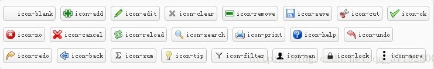

# 1. datagrid使用

## 1.1. 初始化

```javascript
$('#HouseData').datagrid({
    url: '/Ashx/TempHouse.ashx?type=extractinghouseinfo&ownerinfo=' + ownerInfo,
    method: 'get',
    idField: 'house_id',
    loadMsg: "数据加载中......",
    fitColumns: true,//自适应宽度
    singleSelect: true,//是否单选 
    pagination: true,//分页控件 
    pageSize: 15,//每页显示的记录条数，默认为10 
    pageList: [5, 10, 15],//可以设置每页记录条数的列表 
    beforePageText: '第',//页数文本框前显示的汉字 
    afterPageText: '页    共 {pages} 页',
    displayMsg: '当前显示 {from} - {to} 条记录   共 {total} 条记录',
    rownumbers: true,//行号 
    striped: true,//隔行变色
    columns: [[
        { field: 'ck', checkbox: true },
        { field: 'house_id', title: '房屋ID', width: 180, hidden: 'true' },
        { field: 'income_id', title: '业务号', width: 180 },
        { field: 'right_id', title: '房产证号', width: 180 },
        { field: 'owner_name', title: '产权人', width: 180 },
        { field: 'card_id', title: '身份证号', width: 180 },
        { field: 'seat_name', title: '房屋坐落', width: 180 },
        { field: 'build_name', title: "幢名", width: 180 },
        { field: 'house_name', title: "房名", width: 180 },
        { field: 'current_floor', title: "所在层", width: 180 },
        { field: 'build_area', title: "建筑面积", width: 180 },
        { field: 'from_name', title: "产权来源", width: 180 }
    ]],
    enableFilter: true
});
```

## 1.2. load,reload和loadData

```javascript
$(“#grid”).datagrid(“load”,{ }); //里面写的是你要传输的参数的键值对，调用这个方法来加载数据的时候，它传给后台的分页信息是从第一页开始的。
$(“#grid”).datagrid(“reload”,{ });//但它传给后台的分布信息是当前的页码，就是实现刷新当前页的功能。
$(“#grid”).datagrid(“loadData”,{ “total”:”30″,rows:[] });//它加载的本地数据，就是不会跟后台什么的有交互，它的使用方式是
```

## 1.3. 获取选中行

```javascript
if ($("#dg_houselist").datagrid("getSelections").length >= 1) {
    var houseids = "";
    var rows = $("#dg_houselist").datagrid("getSelections");
    for (var i = 0; i < rows.length; i++) {
        if (rows[i].limit_flag =="0") {
            $.messager.alert("警告", rows[i].house_name + "不存在纪监查封");
            return false;
        }
        houseids += rows[i].house_id + ",";
    }


}
else {
    $.messager.alert("友情提示", "请您选择要添加限制的房屋");
}
```

# 2. combobox

## 2.1. 从后台加载数据

```javascript
$("#comboid").combobox({
    url:"/Ashx/ImpownContract.ashx?type=GetOtherMan",
    valueField:"code",
    textField: "name_c",
    onSelect:function(record){
        var selectValue = record.value;
    }
});

//获取json数据格式
[
{"code":"0001","name_c":"中国工商银行股份有限公司兖州支行"},
{"code":"0002","name_c":"中国农业银行股份有限公司兖州市支行"},
{"code":"0003","name_c":"中国建设银行股份有限公司兖州支行"},
{"code":"0004","name_c":"中国银行股份有限公司兖州支行"},
{"code":"0005","name_c":"中国建设银行股份有限公司济宁分行"},
{"code":"0006","name_c":"山东圣泰农村合作银行草桥口支行"},
]
```

## 2.2. 常用方法

```javasript
$("#xx").combobox({disabled: true});      //设置下拉款为禁用
$("#xx").combobox('setValue',xlid);  //设置下拉款的默认值  xlid是你下拉款的id属性
$("#xx").combobox('getValue');      //获取下拉款id值
$("#xx").combobox('getText');      //获取下拉款name值
```

# 3. 判断元素是否隐藏

```javascript
var isHaveHouse =  $("#HouseDiv").is(":hidden");//是否隐藏
var temp1=$("#test").is(":visible");//是否可见
```

# 4. Parser(解析器)

解析器是 easy ui 很重要的基础组件，在 easy ui 中我们可以简单的通过 class 定义一个组件，从而渲染出很好的交互效果，就是通过 parser 进行解析的。

parser 会获取全部在指定内定为 easy ui 组件的 class 定义，而且根据后缀定义把当前节点解析渲染成特定组件。

```javascript
$.parser.parse();//不带参数，默认解析该页面中全部定义为 easyui 组件的节点
$.parser.onComplete();//在解析器完成解析操作的时候触发。
$.parser.parse('#cc');//带一个jquery 选择器，使用这样的方式能够单独解析局部 easyui 组件节点
```

# 5. checkbox

## 5.1. 获取元素下所有checkbox被选中的元素

```javascript
        var systemCodes = [];
        $("#Flags input[type='checkbox']:checked").each(function(index, ele) {
            systemCodes.push(ele.value);
        });
```

## 5.2. 将指定value值的checkobx选中

```javascript
    if (res.Data != null) {
        $("#Flags input:checkbox").each(function (index, ele) {
            var value = ele.value;
            if (res.Data.indexOf(value) >= 0) {
                $(this).attr("checked", 'true');
            }
        });
    }
```

# 常用图标汇总

