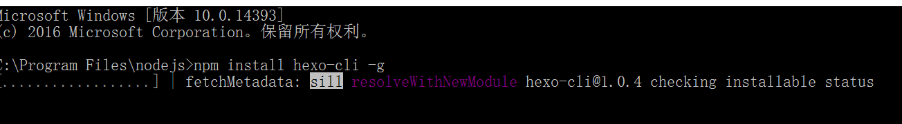
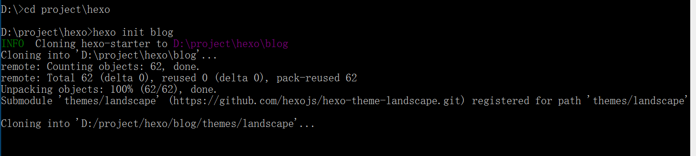
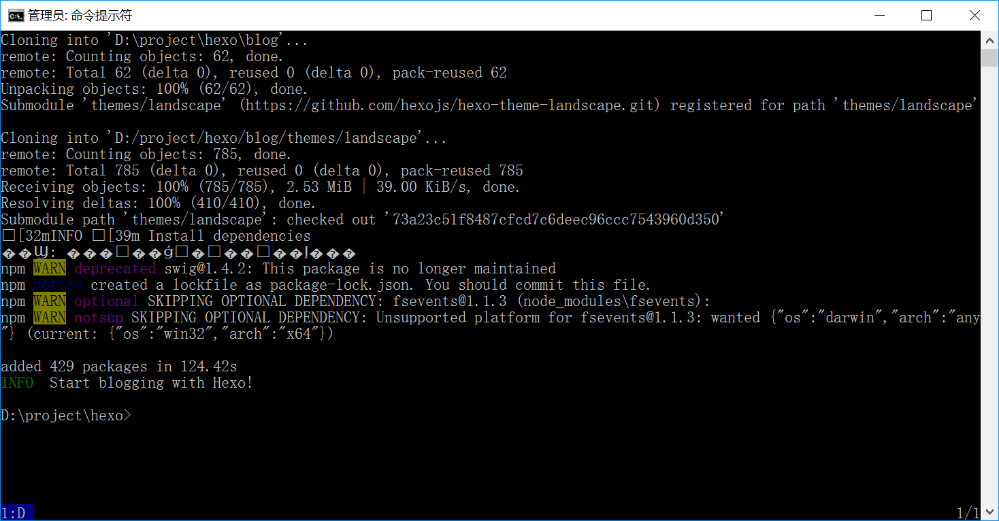
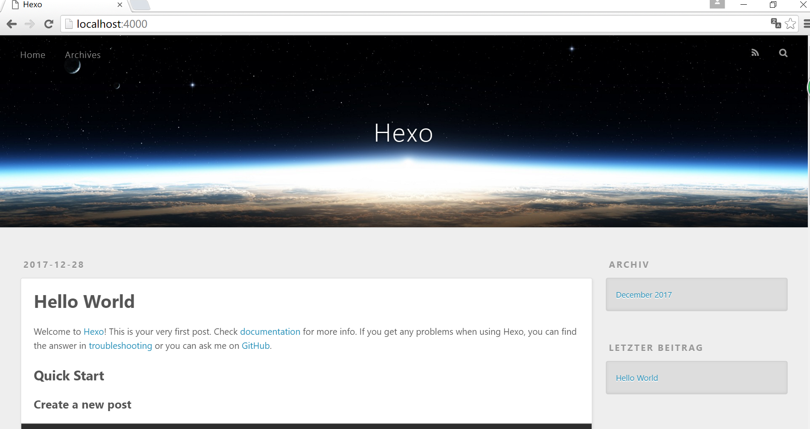
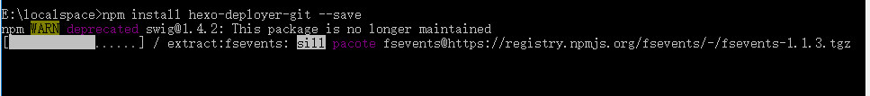

这是我的第一篇博客，我把它献给了提供这个博客的平台，记录一下在GitHub上如何部署自己的博客。
用到的工具：
- Nodejs
  包含npm
- Git
    这个不多说，是必需的
- Hexo
    一个静态博客框架，只需要几条命令就可以快速创建自己的博客。

系统环境
    Windows7 64bit
软件版本
    NodeJs 
    Git 2.15.0.windows.1
    Hexo 3.4.4

# 工具的安装
## NodeJs安装
   在官网下载最新的安装包，按引导一步步安装。
## Git安装
   按引导至安装完成。
## Hexo安装及配置
### Hexo安装
   打开命令行，找到刚才NodeJs的安装目录，输入如下指令
   ```
   npm install hexo-cli -g
   ```
   
### Hexo初始化配置
1. 配置博客目录
    在命令行中进入你要放置博客的路径，执行如下命令，会创建一个Blog的文件夹，并时行一些组件的安装。
   ```
   hexo init blog
   ```
   
   安装完成如下图所示
   
   此时执行
   ```
   hexo server
   ```
  

## 发布到github
### 注册github

```
    npm install hexo-deployer-git –save
```
   

   


    


