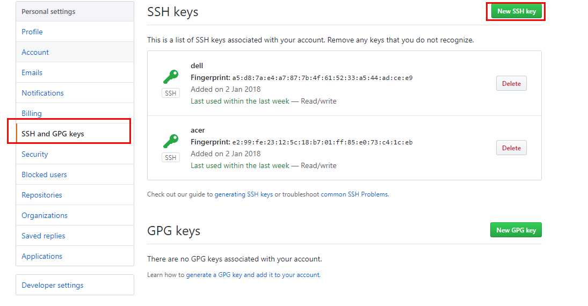
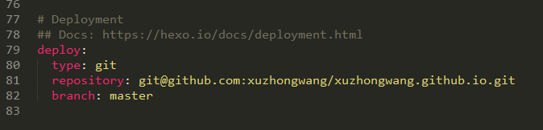

这是我的第一篇博客，我把它献给了提供这个博客的平台，记录一下在GitHub上如何部署自己的博客。
用到的工具：
- Nodejs
  包含npm
- Git
    这个不多说，是必需的
- Hexo
    一个静态博客框架，只需要几条命令就可以快速创建自己的博客。

系统环境
    Windows7 64bit
软件版本
    NodeJs 
    Git 2.15.0.windows.1
    Hexo 3.4.4

# 1. 工具的安装
## 1.1. NodeJs安装
   在官网下载最新的安装包，按引导一步步安装。
## 1.2. Git安装
   按引导至安装完成。
## 1.3. Hexo安装及配置
### 1.3.1. Hexo安装
   打开命令行，找到刚才NodeJs的安装目录，输入如下指令
   ```
   npm install hexo-cli -g
   ```
   
### 1.3.2. Hexo初始化配置
1. 配置博客目录
    在命令行中进入你要放置博客的路径，执行如下命令，会创建一个Blog的文件夹，并时行一些组件的安装。
   ```
   hexo init blog
   ```
   
   安装完成如下图所示
   
   此时执行
   ```
   hexo server
   ```
  

## 1.4. 发布到github
### 1.4.1. 注册github
注册过程不多说，注册完成后，按照如下页面所示设置GitHub Pages https://pages.github.com/

### 1.4.2. SSH key配置
```
$ cd ~/. ssh #检查本机已存在的ssh密钥
```
如果提示：No such file or directory 说明你是第一次使用git。
```
ssh-keygen -t rsa -C "邮件地址"
```

然后连续3次回车，最终会生成一个文件在用户目录下，打开用户目录，找到.ssh\id_rsa.pub文件，记事本打开并复制里面的内容，打开你的github主页，进入个人设置 -> SSH and GPG keys -> New SSH key：

然后在git bash中配置
```
$ git config --global user.name "liuxianan"// 你的github用户名，非昵称
$ git config --global user.email  "xxx@qq.com"// 填写你的github注册邮箱
```

### 1.4.3. 上传插件安装
```
    npm install hexo-deployer-git –save
```
   
   然后在你博客的目录下找到_config.yml配置deploy部分


工具都安装完成后，就可以写博客了

## 1.5. hexo常用命令
``` 
hexo new "postName" #新建文章
hexo new page "pageName" #新建页面
hexo generate #生成静态页面至public目录
hexo server #开启预览访问端口（默认端口4000，'ctrl + c'关闭server）
hexo deploy #部署到GitHub
hexo help  # 查看帮助
hexo version  #查看Hexo的版本
```


   


    


