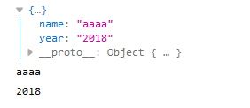
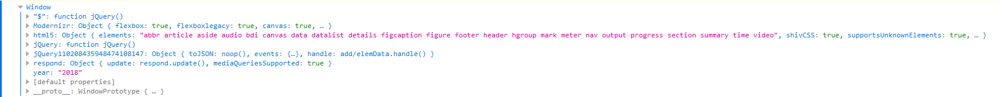
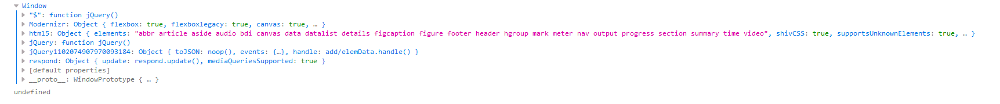
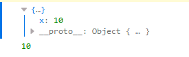
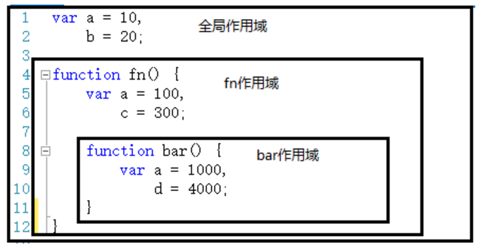
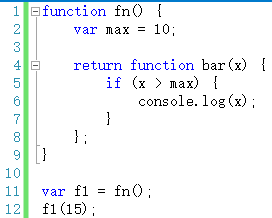
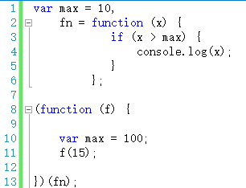

原文：http://www.cnblogs.com/wangfupeng1988/p/3994950.html

# JavaScript判断对象是值类型还是引用类型的方法

```javascript
var fn = function () { };
console.log(fn instanceof Object);  // true
```

# 对象-若干属性和集合

- JavaScript的一切皆是对象
- 对象里面一切皆是属性，没有方法，方法是一种表现为键值对的属性。

# 对象都是通过函数来创建的

# javascript中的this

在函数中this到底如何取值，是在函数真正被调用执行时确定的，函数定义的时候确定不了。
this的取值，分四种情况：

- 构造函数
- 函数作为对象的一个属性
- 函数用call或者apply调用
- 全局&调用普通函数
  
## 构造函数

如果函数作为构造函数用，this指向它即将new出来的对象。

```javascript
function Foo(){
    this.name = "aaaa";
    this.year = "2018";
    console.log(this);
}

var f1 = new Foo();
console.log(f1.name);
console.log(f1.year);
```

结果：

但是如果不是作为构造函数，也就是不是new Foo(),而是直接调用Foo(),则this指向的是Window

```javascript
function Foo(){
    this.name = "aaaa";
    this.year = "2018";
    console.log(this);
}
Foo();
```



## 函数作为对象的一个属性

如果函数作为对象的一个属性，并且作为一个对象的属性被调用时，函数的this指向该对象。

```javascript
var obj = {
    x:10,
    fn:function(){
        console.log(this);
        console.log(this.x);
    }
}
obj.fn();
```

如果不是作为obj的属性被调用，则this指向Window

```javascript
var obj = {
    x:10,
    fn:function(){
        console.log(this);
        console.log(this.x);
    }
}
var fn1 = obj.fn;
fn1();
```



## 函数用call或者apply调用

当一个函数被call或apply调用时，this的值就取传入对象的值

```javascript
var obj = {
    x:10
};

var fn = function(){
    console.log(this);
    console.log(this.x);
}
fn.call(obj);
```



## 全局&调用普通函数

在全局下，this永远是Window
普通函数在调用时，其中this就是Window，如上面1与2的第2个例子全是普通函数

# 执行上下文

执行全局代码时，会产生一个执行上下文环境，函数每次调用都会产生一个函数上下文环境，当函数调用完成后，这个上下文环境以及其中的数据就会被消除，重新回到全局上下文环境。处于活动状态的上下文环境只有一个。
这都通过一个上下文栈来完成


# 作用域

- Javascript没有块级作用域，所谓的块就是{}中间的语句。
- Javascript除了全局作用域外，只有函数可以创建的作用域。
所以在声明变量时，全局代码要在代码前端声明，函数中要在函数体一开始就声明好。除了这两个地方，其它地方不要出现变量声明，而且建议用"单var"形式。


作用域的最大作用就是隔离变量，不同作用域下同名变量不会有冲突。
作用域在函数定义时就已经确定了，而不是在函数调用时确定。

# 自由变量

自由变量要到创建这个函数那个作用域中取值。

# 闭包

## 函数作为返回值


如上代码，bar函数作为返回值，赋值给f1变量。执行f1(15)时，用到了fn作用域下的max变量的值

## 函数作为参数被传递


如上代码中，fn函数作为一个参数被传递进入另一个函数，赋值给f参数。执行f(15)时，max变量的取值是10，而不是100。


