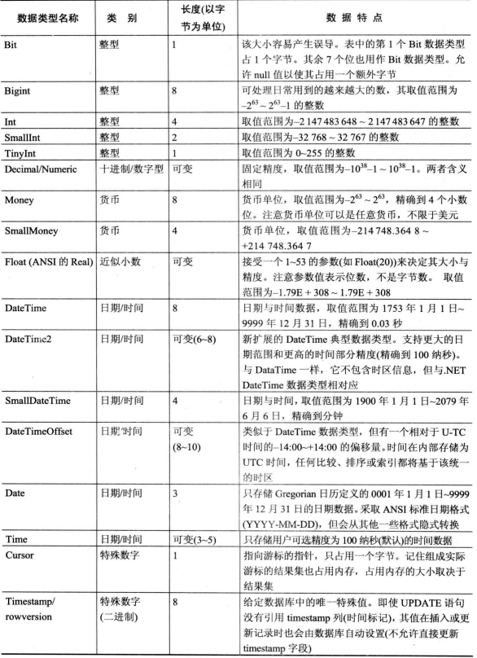
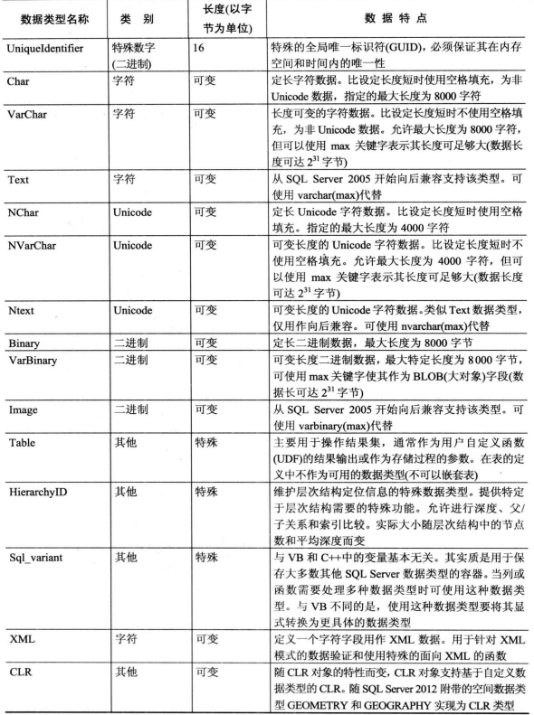

# 1. RDBMS 基础：SQLServer 数据库的构成

## 1.1. 数据对象的概述

数据库对象：

- 数据库本身
- 事务日志
- 表
- 索引
- 文件组
- 数据库关系图
- 视图
- 存储过程
- 用户自定义函数
- 序列
- 用户
- 角色
- 程序集
- 报表
- 全文目录
- 用户自定义数据类型

### 1.1.1. 数据库对象

存储过程和视图是对存储在数据库表中的数据的特定分组

SQL Server 第一次启动时至少包括4个系统数据库

- master：系统表用于系统的总体控件
- model：是指可以基于该模型得一个副本
- msdb：SQL Agent 进程存储任意系统任务的地方
- tempdb：是服务器的主要工作地方之一。在执行一个复杂或者大型的查询操作时，SQL Server可能需要创建一些中间表来完成该操作。每次启动SQLServer,tempdb数据库是系统中唯一完全重建的数据库。

### 1.1.2. 事务日志

实际上，任意数据库的更改起初不进入数据库本身，而是不断地被写入到事务日志。
日志是数据进入磁盘上的最先位置，且稍后会被传播到实际的数据库。需要数据库文件和事务日志一起完成数据库功能。

### 1.1.3. 最基本的数据库对象：表

1. 索引

索引分两类：

- 群集索引：每个表只能有一个群集索引，如果为百科全书做索引，则群集索引是书的页码
- 非群集索引：每个表可以有多个非群集索引。

注意：具有索引的视图在有非群集索引之前必须有一个群集索引

2. 触发器

触发器有多种用途，但主要用于输入时复制数据或在更新时检查数据，确保数据满足相应条件。

3. 约束

### 1.1.4. 文件组

### 1.1.5. 数据库关系图

### 1.1.6. 视图

视图仅仅是表中所存储数据的一个预先计划的映射和表示。视图以查询的形式存储在数据库中。

视图的主要目的是控制视图用户查看的数据。

索引视图除了可以创建索引外，其它都与视图相同，其对使用性能的影响如下：

- 对于引用多个表的视图来说，索引视图的可读性更好，因为它预告构建了表之间的连接。
- 由于预先计算好视图中执行的聚合(aggregation)，并将其作为索引的一部分存储，因此聚合只要执行一次（在插入或更新时），然后就可从索引信息中直接读取它。
- 由于视图上的索引必须及时更新，因此插入和删除索引需要更多的系统开销，如果更新影响到索引的键列或群集键，则更新也需要更多的系统开销。

### 1.1.7. 存储过程

存储过程优点：

- 不使用长字符中文本而使用短字符串存储过程名，可减少运行存储过程中的代码所需要的网络通信流量。
- 预先优化和预编译，节省每次运行存储过程的时间。
- 通常考虑安全原因，或仅仅隐藏数据库的复杂性，将过程封装。
- 可从其它存储过程调用，使得它们在某些限定意义上重用。

### 1.1.8. 用户自定义函数

用户自定义函数（UDF）与存储过程十分相似，不同之处有如下几点：

- 返回值的数据类型包括大部分 SQLServer 数据类型。不包括的返回值数据类型有：text,ntext,image,cursor,timestamp
- 没有“副作用”。基本上用户自定义函数不能超出函数的作用范围。

传送到函数中的所有变量都是按值传递的，但可以返回一种特殊的数据类型--表

### 1.1.9. 序列

序列的作用是提供任意数量的进程都可以访问的序号源，同时保证任意两个进程不会同时获取相同的下一个值。因为序列是单独存在的对象(没有绑定到任何表),所以它可以有多种用途。

### 1.1.10. 用户和角色

### 1.1.11. 规则

### 1.1.12. 默认值

SQL Server 中有两种类型的默认值，包括对象本身的默认值，以及描述表中特定列的元数据的默认值。

### 1.1.13. 用户自定义数据类型

### 1.1.14. 全文目录

## 1.2. SQL Server 数据类型




# 2. 连接

数据库规范化是指将数据从更大的表分割成几个较小的表，目的是消除重复的数据、节省空间、提高数据库性能，并增加数据完整性。

## 2.1. 内部连接

INNER JOIN:内部连接是一个排他的连接，即排除在两表————第一个指定的表（即左表）和第二个指定表（即右表）————中没有匹配的所有记录。

### 2.1.1. 处理更复杂的外部连接

在所有的查询的语句中，JOIN 左侧或之前的所有表只作为一个表，不论查询语句是要包含或排除表中的数据。同样，所有查询语句中 JOIN 右侧或之后的所有表只作为一个表。

通常，应首先使用内部连接，然后尽量少地使用外部连接，这样可以减少代码中的错误。

## 2.2. 联合

JOIN 将信息水平连接（添加更多列），而 UNION 将数据垂直连接（添加更多行）。

# 3. 创建和修改数据表

## 3.1. SQL SERVER 中的对象名

有4层命名约定

```sql
[ServerName.[DatabaseName.[SchemaName.]]]ObjectName
```

# 4. 刍和约束

确保数据完整性不是使用数据库的程序的责任，而是数据库本身的责任。

有3种不同类型的约束

- 实体约束
- 域约束
- 参照完整笥约束

约束的方法

- 主键约束
- 外键约束
- 唯一约束(也称替换键)
- CHECK约束
- DEFAULT约束
- 规则
- 默认值(和DEFAULT约束类似)

## 4.1. 约束的类型

### 4.1.1. 域约束

域约束处理一个或多个列

## 4.2. 键约束

主键、外键、替换键和倒置健

# 5. 更复杂的查询

## 5.1. 子查询的概念

子查询通常用于满足下列某个需求

- 将一个查询分解为一系列的逻辑步骤
- 提供一个列表作为 WHERE 子句和 [IN|EXIST|ANY|ALL]的目标
- 为父查询中的每个记录提供一个查询表

## 5.2. 关联子查询

关联子查询与嵌套子查询的不同之处在于：信息传递是双向的，而不是单向的。在嵌套子查询中，内部查询只处理一次，然后将信息传递到外部查询，而外部查询也只执行一次————提供和您自己可能输入的完全相同的值或列表。

关联子查询处理过程

- 外部查询获取一个记录，然后将该记录传递到内部查询
- 内部查询根据传递的值进行查询
- 内部查询将结果值传递回外部查询，而外部查询利用这些值完成处理过程。


