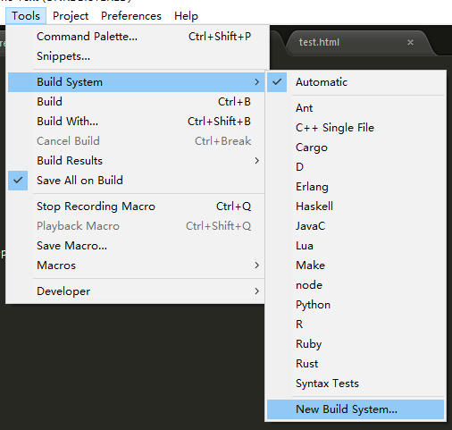
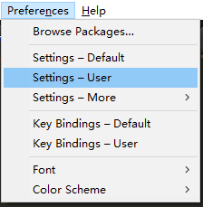
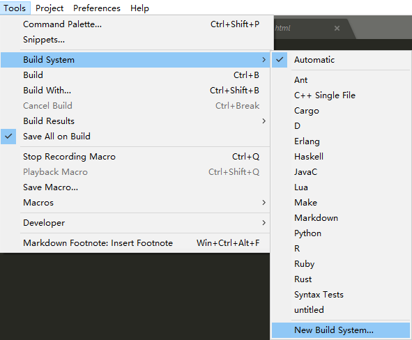

# 替换
Ctrl + H 进行替换

# 安装 Package Control

```bat
import urllib.request,os,hashlib; h = '6f4c264a24d933ce70df5dedcf1dcaee' + 'ebe013ee18cced0ef93d5f746d80ef60'; pf = 'Package Control.sublime-package'; ipp = sublime.installed_packages_path(); urllib.request.install_opener( urllib.request.build_opener( urllib.request.ProxyHandler()) ); by = urllib.request.urlopen( 'http://packagecontrol.io/' + pf.replace(' ', '%20')).read(); dh = hashlib.sha256(by).hexdigest(); print('Error validating download (got %s instead of %s), please try manual install' % (dh, h)) if dh != h else open(os.path.join( ipp, pf), 'wb' ).write(by)
```

## 常用插件

- Emmet：前端开发必备，Write less , show more，使用Tab键触发。安装Emmet后，可以输入少量代码后摁Tab键，系统自动补全代码。
- AutoFileName：快速列出你想引用的文件夹里面所有文件的名字，比如想引用test/img/1.png。只需要输入/img,该插件就会自动提示/img下面的所有文件名，如图
- BracketHighlighter：高亮显示[], (), {}, “”, ”, &lt;tag&gt;&lt;/tag>符号，便于查看起始和结束标记。
- ColorPicker:调色板，需要输入颜色时，可直接选取颜色。使用快捷键ctrl+shift+c即可打开调色板。需要注意的是，这个快捷键可能会打不开调色板，原因是该快捷键被占用了，最直接的解决办法是直接在Preferences→Key Bindings-User中配置：“{ "keys": ["ctrl+shift+c"], "command": "color_pick"},”
- JsFormat:JsForma可以自动帮助你格式化JavaScript代码，形成一种通用的格式，比如对压缩、空格、换行的js代码进行整理，使得js代码结构清晰，易于观看。在已压缩的JS文件中，右键选择jsFormat或者使用默认快捷键（Ctrl+Alt+F），如果该热键被占用了，可以在Preferences→Key Bindings-User中配置： { "keys": ["ctrl+shift+alt+j"], "command": "js_format","context": [{"key": "selector", "operator": "equal", "operand": "source.js,source.json"}]},
- DocBlockr:安装该插件后，可以快速生成各种注释格式，当需要生成注释符号时，输入/*、/然后回车系统即帮你自动生成，如果/后面刚好是一个函数的定义，注释格式会根据函数的参数生成。
- Sidebar Enhancements:sub侧栏右键文件提供的功能很少，但在实际开发中，文件通常会有各种处理请求，而该插件增强侧栏文件右键功能，比如可以直接右键将文件移入回收站，在浏览器中浏览，将文件复制到剪切板等。详情查看sidebar文档,安装该插件前，文件右键选项很少：安装插件后，文件右键选项大大增强：
  
    我常用的两个功能是设置文件使用浏览器打开的快捷键F12和重命名F2，需要自己往Key-Bindings-User里面添加
{ "keys": ["f12"], "command": "side_bar_open_in_browser","args":{"paths":[], "type":"testing", "browser":""}},
 { "keys": ["f2"], "command": "side_bar_rename"},

 - Alignment:对定义的变量进行智能对齐,一般是“=”号对齐，默认的快捷键是Ctrl+Alt+A，但这个热键和QQ截屏的热键冲突不能使用，需要自己重新设置，我通常设置成Ctr+Alt+Shift+A，以下粘贴到Key-Bindings-User里面：

```json
    { "keys": ["ctrl+alt+shift+a"], "command": "alignment" }
```

 - CSS Format:CSS Format可以将任意的 CSS、SASS、SCSS、LESS 代码格式化为展开、紧凑、压缩的形式，选中需要格式化的样式代码，右键选中CSS Format，选择需要形成的格式即可。
 - Tag:Tag插件提供各种对Tag标签的操作，具有功能：根据/自动关闭HTML标签，标签自动缩进（或选中ctrl+alt+f），删除标签和里面的内容，插入标签（对光标字符“ctrl+shift+,”生成标签），删除标签里的属性，关闭标签，检查标签等。有些功能是自动执行，有些功能需要手动执行，功能入口 菜单栏Edit→
 Tag。
 - Trailing spaces:可以检测和一键删除代码的空格，保存时自动删除多余空格，让你的代码更加紧凑规范。功能入口：Edit→
 Trailing Spaces→
 Delete，也可以自己设置快捷键，我通常设置成ctrl+shift+alt+t，以下粘贴到Key-Bindings-User里面：

 ```json
{ "keys": ["ctrl+shift+alt+t"], "command": "delete_trailing_spaces" }
 ```

 - ConvertToUTF8:通过本插件，您可以编辑并保存目前编码不被 Sublime Text 支持的文件，特别是中日韩用户使用的 GB2312，GBK，BIG5，EUC-KR，EUC-JP 等。可以通过 File→
 Set File Encoding to 菜单对文件编码进行手工转换。例如，您可以打开一个 UTF-8 编码的文件，指定保存为 GBK，反之亦然。

 - HTML-CSS-JS Prettify:格式化HTML,CSS,javascript和Json代码格式。使用该插件，需要安装nodejs，而且要在Packages-Setting→
 HTML/CSS/JS Prettify→
 set node path中设置你node的安装路径。使用过程：Tools→
 Command Palette(或者Ctrl+Shift+P)，输入选择htmlprettify即可完成整个文档的格式化。也可以设置快捷键：Packages-Setting→HTML/CSS/JS Prettify→set keyboard shortcuts，因为我的ctrl+shift+h已经被占用，所以我改成ctrl+shift+alt+h。

 - Terminal:打开文件的终端，终端默认是CMD。ctrl+shift+t 打开文件所在文件夹，ctrl+shift+alt+t 打开文件所在项目的根目录文件夹，可以自己重新配置快捷键。也可以右键open terminal here打开。


汇总一下前面介绍的插件：

- Alignment
- AutoFileName
- BracketHighlighter
- ColorPicker
- CSS Format
- DocBlockr
- Emmet
- JsFormat
- Sidebar Enhancements
- Tag
- Trailing Spaces
- ConvertToUTF8
- HTML-CSS-JS Prettify
- Terminal

以及因为这些插件而重新设置的快捷键：

```json
[html] view plain copy 
1.{ "keys": ["ctrl+alt+shift+a"], "command": "alignment" },  
2.{ "keys": ["ctrl+shift+alt+f"], "command": "show_panel", "args": {"panel": "find_in_files"} },  
3.{ "keys": ["ctrl+alt+u"], "command": "soft_undo" },  
4.{ "keys": ["ctrl+shift+alt+t"], "command": "delete_trailing_spaces" },  
5.{ "keys": ["f12"], "command": "side_bar_open_in_browser","args":{"paths":[], "type":"testing", "browser":""}},  
6.{ "keys": ["alt+f12"], "command": "side_bar_open_in_browser","args":{"paths":[], "type":"production", "browser":""}},  
7.{ "keys": ["ctrl+t"], "command": "side_bar_new_file2"},  
8.{ "keys": ["f2"], "command": "side_bar_rename"},  
9.{ "keys": ["ctrl+shift+c"], "command": "color_pick"},  
10.{ "keys": ["ctrl+shift+alt+j"], "command": "js_format","context": [{"key": "selector", "operator": "equal", "operand": "source.js,source.json"}]},  
```

还有很多插件需要根据你使用的库和框架自己去添加，比如jQuery、angular、node.js、less等，只要Ctr+Shift+p输入关键词即可找到你想安装的插件。

sublimeCodeIntel

js智能提示，超级好用

因为快捷键过多，下面仅罗列一下比较常用的快捷键：

1.操作
Ctrl + `： 打开Sublime Text控制台（Esc退出）
Ctrl+Shift+P：打开命令面板（Esc退出）
Ctrl + K, Ctrl + B： 组合键，显示或隐藏侧栏
Alt ：光标调到菜单栏，↑↓←→ 移动光标

2.编辑
Ctr+Shift+D：复制粘贴光标所在行
Alt+.：关闭标签
Ctrl+/：用//注释当前行。
Ctrl+Shift+/：用/**/注释。
Ctrl + Enter： 在当前行下面新增一行然后跳至该行
Ctrl + Shift + Enter： 在当前行上面增加一行并跳至该行
Ctrl + ←/→： 进行逐词移动，
Ctrl + Shift + ←/→： 进行逐词选择
Ctrl + Shift + ↑/↓： 移动当前行（文件会被修改）
Ctrl+KK ：从光标处删除至行尾
Ctrl+K Backspace ：从光标处删除至行首
Ctrl+Z：撤销
Ctrl+Y：恢复撤销
Ctrl+J：合并行（已选择需要合并的多行时）
Ctrl + [： 选中内容向左缩进
Ctrl + ]： 选中内容向右缩进

3.选择
Alt+F3：选中关键词后，选中所有相同的词。可以配合Ctrl+D使用。
Ctrl + D Ctrl + K Ctrl + U：Ctrl + D选择当前光标所在的词并高亮该词所有出现的位置，再次Ctrl + D，会选择该词出现的下一个位置。在多重选词的过程中，Ctrl + K会将当前选中的词进行跳过在多重选词的过程中，Ctrl + U进行回退
Ctrl+L ：选择光标所在整行
Ctrl+X：删除光标所在行
Ctrl + J： 把当前选中区域合并为一行
Ctrl+Shift+M：选中当前括号内容，重复可选着括号本身

4.查找
 （如果有窗口弹出都是Esc退出弹出窗口）
Ctr+p：输入@显示容器（css或者js里面）
Ctrl + F： 调出搜索框
Ctrl + H： 调出替换框进行替换
Ctrl + Shift + H： 输入替换内容后，替换当前关键字
Ctrl + Alt + Enter： 输入替换内容后，替换所有匹配关键字。(NOTE: 注意此时如果鼠标焦点在编辑窗口中，则替换失败，将鼠标焦点调到替换框中，Ctrl + Alt + Enter才会起作用)
Ctrl + Shift + F： 开启多文件搜索&替换
Alt + C： 切换大小写敏感（Case-sensitive）模式
Alt + W： 切换整字匹配（Whole matching）模式
Alt + R： 切换正则匹配模式的开启/关闭

5.跳转
Ctrl + P：列出当前打开的文件（或者是当前文件夹的文件），输入文件名然后 Enter 跳转至该文件，输入@symbol跳转到symbol符号所在的位置，输入#keyword跳转到keyword所在的位置，输入:n跳转到文件的第n行
Ctrl + R：列出当前文件中的符号（例如类名和函数名，但无法深入到变量名），输入符号名称 Enter 即可以跳转到该处。
 会列出Markdown文件的大纲
F12： 快速跳转到当前光标所在符号的定义处（Jump to Definition）。比如当前光标所在为一个函数调用，F12会跳转至该函数的定义处。
Ctrl + G： 输入行号以跳转到指定行
Ctrl+M：跳转到括号另一半。

6.窗口和Tab页
Ctrl + N： 在当前窗口创建一个新标签
Ctrl + Shift + N： 创建一个新窗口（该快捷键 和搜狗输入法快捷键冲突）
Ctrl + W： 关闭标签页，如果没有标签页了，则关闭该窗口
Ctrl+Shift+W：关闭所有打开文件
Ctrl + Shift + T： 恢复刚刚关闭的标签。
Ctrl +Tag：移动标签。

7.屏幕
F11： 切换普通全屏
Shift + F11： 切换无干扰全屏
Alt + Shift + 2： 进行左右分屏
Alt + Shift + 8进行上下分屏
Alt + Shift + 5进行上下左右分屏（即分为四屏）
Ctrl + 数字键： 跳转到指定屏
Ctrl + Shift + 数字键： 将当前屏移动到指定屏


# 搭建 JavaScript 运行环境

## 安装 NodeJs

## 配置 sublime



添加如下代码

```json
{
   "cmd": ["node","$file"]
}
```



添加如下配置

```json
{
"build_env": {
    "PATH": "C:/Program Files/nodejs"
}
}
```

PATH的值是nodejs的安装路径。 

## 测试

新建一个文件，随便写一段JavaScript代码，按快捷键：
Ctrl + B
即可看到运行结果。

# 解决PackageControl无法使用的问题

1.下载 JSON文件：“https://packagecontrol.io/channel_v3.json”；

2.修改 JSON文件中的版本号“schema_version”，将“3.0.0”修改为 “2.0”；

3.打开 首选项 --》插件设置 --》Package Control --》 设置-用户  （或者“设置-默认”）

4.修改第3步设置文件中的 channels 属性的值，
在 channels[……]的最前面添加 JSON文件 的 地址（步骤1下载的文件）
注意：英文逗号分割  和  斜线方向

```json
"channels":
[
	"D:/Program Files/Sublime Text 3.3126x64/Data/ChannelJson_download/channel_v3.json",
	"https://packagecontrol.io/channel_v3.json"
]
```

5.保存上述打开的文件。

```cmd
 Ctrl+Shift+P 输入“pc:ip”（package control:install package），回车。
```

# 设置默认浏览器



在配置文件中添加如下内容：

```set
{
	"cmd":["C:/Program Files/Mozilla Firefox/firefox.exe","$file"],
	"selector":["text.html"]
}
```

ctrl+B 预览

# 安装Minify 

## 通过 Package Control 安装Minify

按 ctrl + shift + p   输入  Install Package 然后   输入Minify  按回车就可以安装啦

## 安装note.js

安装合成后打开cmd输入   node --version 如果出现版本信息就可以啦,否则的话就把nodejs的路径添加到系统环境变量里去;

## 打开cmd输入下面命令安装

```npm
npm install -g clean-css uglifycss js-beautify html-minifier uglify-js minjson svgo
```

如果你已经安装过其中的一些的话可以用下面命令更新

```npm
npm update -g clean-css uglifycss js-beautify html-minifier uglify-js minjson svgo
```

## 开始使用

使用ctrl + alt + m 压缩文件 会生成一个新的min文件

使用ctrl + alt + shift + m 格式化文件

## 自定义（示例）

```set
  {
      "settings": {
          "Minify": {
              "open_file": false,
              "auto_minify_on_save": true,
              "allowed_file_types": [
                  "css",
                  "js",
                  "svg"
              ]
          }
      }
  }
```
 
PS:

sublime js解压 jsFormat插件

使用方法：
1、快捷键：ctrl+alt+f
2、先用快捷键打开命令面板 “ctrl + shift + p”, 再输入 “Format: Javascript” 就可以使用格式化命令

# 安装SublimeCodeIntel

## 安装CodeIntel 

```python
pip3 install --upgrade --pre CodeIntel
```

# SublimeREPL

设置快捷键

```python
	{ "keys": ["f5"],
	  "caption": "SublimeREPL: Python - RUN current file",        
	  "command": "run_existing_window_command",        
	  "args": {
	  	    "id": "repl_python_run",            
	  		"file": "config/Python/Main.sublime-menu"
        }
    }
```