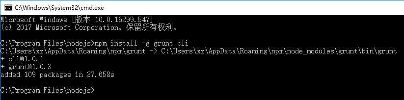
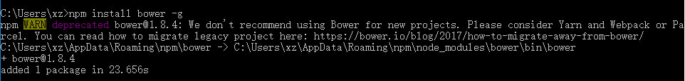
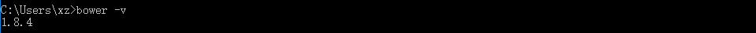

# 插件安装

- Nodejs
- grunt
- bower
- express
- supervisor

## grunt

```npm
npm install -g grunt cli
```



## bower

```npm
npm install bower -g
```



验证是否安装成功



## express

安装express，在cmd中输入：npm express -gd;   -g代表安装到NODE_PATH的lib里面，而-d代表把相依性套件也一起安装。如果沒有-g的话会安装目前所在的目录。


