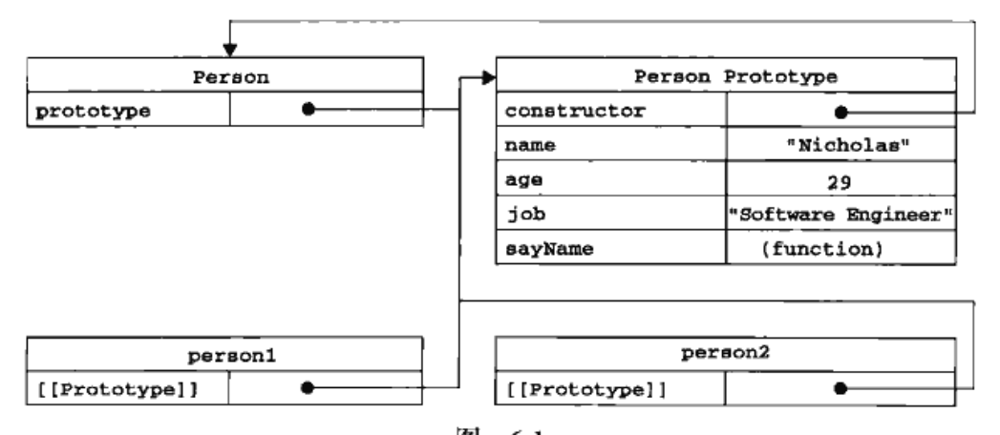
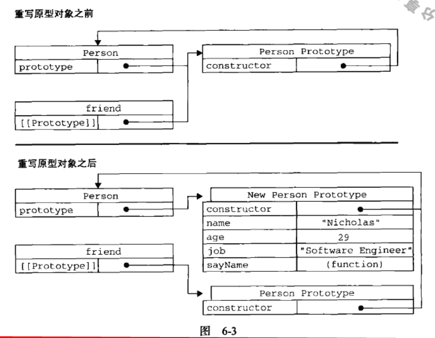

# 1. JavaScript简介

## 1.1. JavaScript简史

最初设计的主要目的是为了处理以前由服务器端语言(如Perl)负责的一些输入验证操作。

## 1.2. JavaScript实现

一个完整的JavaScript实现由三部分组成

- 核心：ECMAScript
- 文档对象模型：DOM
- 浏览器对象模型：BOM

# 2. 在HTML中使用JavaScript

## 2.1. &lt;script&gt;元素

带有src属性的&lt;script&gt;元素不应该在其&lt;script&gt;和&lt;/script&gt;标签之间再包含额外的javascript代码。如果包含了嵌入的代码，则只会加载并执行外部脚本文件，嵌入的代码会被忽略。

### 2.1.1. 延迟脚本

HTML4.0.1为&lt;script&gt;标签定义了defer属性。这个属性的用途是表明脚本在执行时不会影响页面构造。也就是说脚本会延迟到整个页面都解析完成后再运行。相当于告诉浏览器立即下载但延迟执行。
defer属性只适用于外部文件。

### 2.1.2. 异步脚本

async只适用于外部文件脚本，其与defer的不同点：
不能保证按照指定的先后顺序执行。因此确定两者之间互不依赖很重要。

### 2.1.3. 在XHTML中的用法

什么是XHTML：将HTML作为XML的应用而重新定义的一个标准。

## 2.2. 嵌入代码与外部文件

使用外部文件的优点

- 可维护性
- 可缓存
- 适应未来

# 3. 基本概念

## 3.1. 语法

任何语言的核心都必然会描述这门语言最基本的工作原理。而描述的内容通常都要涉及这门语言的语法、操作符、数据类型、内置功能等用于构建复杂解决方案的基本概念。

### 3.1.1. 区分大小写

ECMAScript中的一切(变量、函数名和操作符)都区分大小写。

### 3.1.2. 严格模式

要在整个脚本中启用严格模式，可以在顶部添加如下代码：

```javascript
"use strict"
```

也可以指定函数在严格模式下执行：

```javascript
function(){
    "use strict"
    do something;
}
```

## 3.2. 变量

ECMAScript中的变量是松散类型的。所谓的松散类型是可以保存任何类型数据。换句话说，每个变量仅仅是一个用于保存值的占位符而已。

## 3.3. 数据类型

ECMAScript中有5种简单的数据类型，也称为基本数据类型。
Undefined，Null，Boolean，Number，String和复杂的数据类型Object(本质上由一组无序的名值对组成)

### 3.3.1. typeof操作符

typeof的可能结果

- 'undefined':如果这个值未定义
- 'boolean':这个值是布尔值
- 'string': 这个值是字符串
- 'number':这个值是数值
- 'object':这个值是对象或null
- 'function':这个值是函数

typeof是一个操作符而不是函数，因此typeof(value)中的圆括号尽量可以使用，但不是必须的。

### 3.3.2. Undefined类型

Undefined类型只有一个undefined值。在使用var声明变量但未对其进行初始化时，这个变量的值就是undefined
对未初始化和未声明变量执行typeof操作符都会返回undefined

### 3.3.3. Null类型

Null类型是第二个只有一个值的数据类型，这个特殊的值是null

### 3.3.4. Boolean类型

Boolean类型的字面值true和false是区分大小写的。也就是说True和False（以及其它混合大小写形式）都不是Boolean值，只是标识符。
要将一个值转换为其对应的Boolean值，可以调用转型函数Boolean()
Boolean()值返回值规则

| 数据类型  | 转换为true的值             | 转换为false的值 |
| --------- | -------------------------- | --------------- |
| Boolean   | true                       | false           |
| String    | 任何非空字符串             | ""(空字符串)    |
| Number    | 任何非零数字值(包括无穷大) | 0和NaN          |
| Object    | 任何对象                   | null            |
| Undefined | n/a                        | undefined       |

### 3.3.5. Number类型

八进制字面值的第一位必须是零(0),然后是八进制序列(0-7)。如果字面值中的数值超出了范围，那么前导零将被忽略，后面的值当作十进制数值解析。
ECMAScript能够表示的最小数值保存在Number.MIN_VALUE，最大值保存在Number.MAX_VALUE。如果数值超过这个范围，将自动转换成Infinity值。
要想确定一个数值是不是有穷的，可以用IsFinite()函数，这个函数在参数位于最小值与最大值之间会返回true。
NaN(not a number)即非数值，是一个特殊的数值，其特点：

- 任何涉及NaN的操作都会返回NaN
- NaN与任何值都不相等，包括NaN本身。

ECMAScript定义了isNaN()函数，判断这个参数是否"不是数值",任何不能被转换为数值的值都会导致这个函数返回true
可以把非数值转换成数值的函数：Number(),parseInt(),parseFloat()
Number()转换规则：

- 如果是Boolean值，true和false将分别转换成1和0
- 如果是数字值，则是简单的传入和传出
- 如果是null值，返回0
- 如果是undefined，返回NaN
- 如果是字符串，则遵循下列规则：
  - 如果字符串中只包含数字(包括前面带正号或者带负号的情况),则将其转换为十进制数值。注意前导零会被忽略。
  - 如果字符串中包含有效的浮点格式，则将其转换成对应的浮点数值，同样会忽略前导零。
  - 如果字符串中包含有效的十六进制格式，例如：'0xf",则将其转换为相同大小的十进制整数值。
  - 如果字符串是空的(不包含任何字符),则将其转换成0
  - 如果字符串中包含除上述格式之外的字符，则将其转换为NaN

- 如果是对象，则调用对象的valueOf()方法，然后依照前面的规则转换返回的值。如果转换的结果是NaN，则调用对象的toString()方法，然后再依次按照前面的规则转换返回的字符串值。

处理整数时常用的parseInt()函数，其转换过程为：忽略字符串前面的空格，直到找到第一个非空格字符，如果第一个字符不是数字字符或负号，则会返回NaN。

```javascript
//parseInt小例子
var number = parseInt("1234blue");// 1234
var number = parseInt("");        // NaN
var number = parseInt("22.5");    // 22
var number = parseInt("0xf");     // 15(16进制数)
var number = parseInt("070");     // 56(8进制数)
var number = parseInt("70");      // 70(10进制数)
```

parseInt(value,进制)//第二个参数可以指定基数

parseFloat()与parseInt()类似，它们的区别是前者

- 第一个小数点有效
- 如终忽略前导的零

### 3.3.6. String类型

转义：

- \xnn : 以十六进制代码nn表示的一个字符(其中n为0-F).如\x41表示"A"

- \unnnn: 以十六进制代码nnnn表示的一个Unicode字符(其中n为0-F).如：\u03a3表示希腊字符

字符串转换方法

- toString()：null和undefined值没有这个方法，默认情况下数字返回十进制，也可以指定基数toString(进制)

- String()：在不知道转换的值是不是null或undefined情况下使用，这个函数能够将任何类型的值转换成字符串。如果是null，是返回"null"，undefined返回"undefined" 

### 3.3.7. Object类型

Object类型都具有的属性和方法

- Constructor：保存着用于创建当前对象的函数。
- hasOwnProperty(propertyName):用于检查给定的属性在当前对象实例中(而不是在实例的原型中)是否存在。其中，作为参数的属性名(propertyName)必须以字符串的形式指定。
- isPrototypeOf(Object):用于检查传入的对象是否是另一个对象的原型。   
- propertyIsEnumerable(propertyName):用于检查给定的属性是否能够使用for-in语句来枚举。
- toLocaleString():返回对象的字符串表示，该字符串与执行环境的地区对应。
- toString():返回对象的字符串表示。
- valueOf():返回对象的字符串、数值或布尔值表示。通常与toString()方法的返回值相同中。

## 3.4. 操作符

### 3.4.1. 位操作符

无符号右移操作符由3个大于号(&gt;&gt;&gt;)表示。

### 3.4.2. 布尔操作符

布尔操作有三个：非(NOT)、与(AND)和或(OR)
逻辑非运算符规则：

- 如果操作数是一个对象，返回false.
- 如果操作数是一个空字符串，则返回true.
- 如果操作数是一个非空字符串，返回false.
- 如果操作数是数值0，返回true.
- 操作数是任意非零数值(包括Infinity)，返回false.
- 如果操作操作数是null，返回true.
- 操作数是NaN，返回true.
- 操作数是undefined，返回true.

### 3.4.3. 乘性操作符

乘性操作符有三个：乘法、除法和求模。
如果参与乘法计算的某个操作数不是数值，后台会先使用Number()转型函数将其转换成数值。
### 3.4.4. 相等操作符

全等操作符由3个等号(===)表示，它只在两个操作数未经转换就相等的情况下返回true.

## 3.5. 语句

### 3.5.1. label语句

使用lable语句可以在代码中添加标签，以便将来使用。语法如下：

```javacript
label:statement
```

### 3.5.2. with语句

with语句的作用是将代码的作用域设置到一个特定的对象中，with语句的语法如下：

```javacript
with(expression) statement;
```

定义with的目的主要是为了简化多次编写同一个对象的工作。

```javacript
var qs = location.search.substring(1);
var hostName = location.hostName;
var url = location.href;
//使用with
with(location){
    var qs = search.substring(1);
    var hostName = hostName;
    var url = href;
}
```

严格模式下不允许使用with语句，否则被视为语法错误。
with语句不建议使用。

## 3.6. 函数

### 3.6.1. 理解参数

ECMAScrip函数不介意传进来多少个参数，也不在乎传进来参数是什么类型。原因是ECAMScript中的参数内部是用一个数组来表示。函数接收的始终是这个数组，而不关心数组中包含哪些参数。在函数体内可以通过arguments对象来访问这个参数数组，从而获取传递参数的每一个参数。
ECMAScript函数的一个重要特点：命名的参数只提供便利，但不是必需的。

# 4. 变量、作用域和内存问题

## 4.1. 基本类型和引用类型的值

### 4.1.1. 传递参数

ECMAScript中所有函数的参数都是按值来传递的。
例子：

```javacript
function setName(obj){
    obj.name = "Nicholas";
    obj = new Object();
    obj.name = "Greg";
}
var person = new Object();
setName(person);
alert(person.name);  //"Nicholas"
```

### 4.1.2. 检测类型

typeof操作符是确定一个变量是字符串、数值、布尔值，还是undefined的最佳工具。
使用typeof操作符检测函数时，返回"function"
检测引用类型的时，提供instanceof.

## 4.2. 执行环境及作用域

每个执行环境都有一个与之关联变量对象，环境中定义的所有变量和函数都保存在这个对象中。虽然我们编写的代码无法访问这个对象，但解析器在处理数据时会在后台使用它。
每个函数都有自己的执行环境。当执行流进入一个函数时，函数的环境会被推入一个环境栈中。而在函数执行之后，栈将其环境弹出，把控制权返回给之前的执行环境。
当代码在一个环境中执行时，会创建变量对象的一个作用域链(scope chain)。作用域链的用途，是保证对执行环境有权访问的所有变量和函数的有序访问。作用域链的前端，始终都是当前执行的代码所在环境的变量对象。如果这个环境是函数，由将其活动对象(activation object)作为变量对象。活动对象最开始时只包含一个变量，即arguments对象(这个对象在全局环境中是不存在的)。作用域链中的下一个变量对象来自包含(外部)环境，而再下一个变量对象则来自下一个包含环境。这样一直延续到全局执行环境。全局执行环境的变量对象始终都是作用域链的最后一个对象。
标识符解析是沿着作用域链一级一级地搜索标识符的过程。

### 4.2.1. 没有块级作用域

JavaScript没有块级作用域。

1. 声明变量

使用var声明的变量会自动被添加到最接近的环境中。如果初始化变量时没有var声明，该变量会自动添加到全局环境。

## 4.3. 垃圾收集

### 4.3.1. 标记清除

javascript中最常用的垃圾收集方式是标记清除(mark-and-sweep).

### 4.3.2. 引用计数

另一种不太常见的垃圾收集策略叫做引用记数。

### 4.3.3. 管理内存

优化内存占用的最佳方式，就是为执行中的代码只保存必要的数据。一旦数据不再有用，最好通过将其值设置为null来释放引用--这个做法叫做解除引用(derefrencing)。

# 5. 引用类型

对象是某个特定引用类型的实例。

## 5.1. Object类型

创建Object实例的方式有两种。
第一种是new操作符后跟object构造函数。
另一种方式是使用对象字面量表示法

```javacript
var person = {
    name:"Nicholas",
    age:29
}
```

## 5.2. Array类型

与其它语言不同的是，ECMAScript数组的每一项都可以保存任何类型的数据。而且ECMAScript数组的大小是可以动态调整的，即可以随着数据的添加自动增长以容纳新增数据。
创建数组的基本方式有两种：

- 第一种是使用Array构造函数

```javacript
var colors = new Array();
```

也可以省略new操作符

```javacript
var colors = Array(3);
```

- 第二种是使用数据字面量表示法。数组的字面量由一对包含数组项的方括号表示，多个数组项之间以逗号隔开。

```javacript
var colors = ["red","blue","green"];
```

数组的length属性很有特点：它不是只读的。利用length属性可以方便地在数组末尾添加新项：

```javacript
colors[colors.length] = "black";
```

### 5.2.1. 检测数组

- instanceof检测

```javacript
if (value instanceof Array) {
    //对数组执行某些操作
}
```

- Array.isArray()方法

```javacript
if(Array.isArray(value)){
    //对数组执行某些操作
}
```

### 5.2.2. 栈方法

数组可以表现的像栈一样。
栈是一种LIFO(Last-In-First-Out)后进先出的数据结构。ECAMScript为数组专门提供了push()和pop()方法，以便实现类似栈的行为。
push()方法可以接收任意数量的参数，把它们逐个添加到数组末尾，并返回修改后数组的长度。
pop()方法则从数组末尾移除最后一项，减少数组的length值，然后返回移除的项。

### 5.2.3. 队列方法

队列数据结构的访问规则是FIFO(First-In-First-Out)先进先出。实现这一操作的数组方法是shift(),它能够移除数组中的第一项并返回该项，同时将数组长度减速1.结合shift()和push()方法，可以像队列一样使用数组。
unshift()方法与shift()方法作用相反。它能够在数组前端添加任意个项并返回新数组的长度。因此unshift()与pop()方法，可以从相反的方向来模拟队列，即在数组的前端添加项，从数组的末尾移除项。

### 5.2.4. 重排序方法

数组中已经存在两个可以用来重排序的方法：reverse()和sort()方法。
reverse()会反转数组项的顺序。
sort()方法在默认情况下会按升序排列数组项。
sort()方法会调用每个数组项的toString()转型方法，然后比较得到的字符串，以确定如何排序。即使数组中的每一项都是数值，sort()方法比较的也是字符串。
sort()方法可接收一个比较函数作为参数，以便我们指定哪个值在哪个值前面。比较函数接收两个参数，如果第一个参数应该位于每二个之前同返回一个负数。如果两个参数相等则返回0，如果第一个参数应该位于第二个之后则返回一个正数。
比较函数示例：

```javacript
function compare(value1,value2){
    if(value1&lt;value2){
        return -1;
    }else if(value1&gt;value2){
        return 1;
    }else{
        return 0;
    }
}
```

对于数据值类型的比较函数可以简化为

```javacript
function compare(value1,value2){
  return value2 - value1;
}
```

### 5.2.5. 操作方法

#### 5.2.5.1. concat()方法

- 无参数情况下复制当前数组并返回副本

- 参数是一个或多个数组，则会将这些数组中的每一项都添加到结果数组中

- 参数不是数组，则会简单地添加到结果数组的末尾

#### 5.2.5.2. slice()方法

可接收一个或两个参数，不影响原数组

- 一个参数时，返回从该参数指定位置开始到当前数组末尾的所有项

- 两个参数时，返回起始位置和结束位置中间的项，但不包括结束位置的项。如果结束位置小于起始位置则返回空数组

如果参数中有负数，则用该数组的长度加上该数来确定位置。

#### 5.2.5.3. splice()方法（最强大的数组方法）

主要用途是向数组中部插入项，该方法始终都会返回一个数组，该数组中包含从原始数组中删除的项（如果没有删除任何项，则返回一个空数组）

- 删除：可以删除任意数量的项，只需要指定2个参数，要删除的第一项的位置和要删除的项数。

- 插入和替换: 向指定位置插入任意数量的项，只需要提供3个参数：起始位置、0（要删除的项数）、要插入的项（可以是多个项）。

### 5.2.6. 位置方法

两个方法：indexOf()和lastIndexOf().这两个方法都接收两个参数

- 要查找的项

- 表示查找起点的索引（可选）

### 5.2.7. 迭代方法

5个迭代方法，每个方法都接收2个参数，如下：

- 要在每一项上运行的函数，该函数会接收3个参数。
     1 数组项的值
     2 该项在数组中的位置
     3 数组对象本身

- 运行该函数的作用域对象（可选），该参数影响this的值

5个迭代方法都会对数组中的每一项运行指定函数，区别如下：

- every():如果函数对每一项都返回ture，则返回true，(&&)

- filter():返回运行指定函数返回true的项的数组。

- forEach():无返回值

- map():返回每次函数调用的结果组成的数组。

- some():如果该函数对任意一项返回ture，则返回ture,(||)

### 5.2.8. 缩小方法

2个缩小数组的方法：reduce()和reduceRight().区别是reduce()方法从数组的第一项开始，逐个遍历到最后，reduceRight()则方向相反。
两个方法都接收2个参数

- 在每一项上调用的函数,函数接收4个参数
    1 前一个值
    2 当前值
    3 项的索引
    4 数组对象

- 作为缩小基础的初始值（可选）

## 5.3. Date 类型

Date类型使用UTC(Coordinated Universal Time，国际协调时间)1970年1月1日午夜(零时)开始经过的毫秒数来保存日期。

### 5.3.1. Date.parse()

方法接收一个表示日期的字符串参数，然后尝试根据这个字符串返回相应日期的毫秒数，如果字符串不能表示日期，则会返回NaN.
如果直接调用Date构造函数，也会在后台调用此Date.parse()。

### 5.3.2. Date.UTC()

同样返回表示日期的毫秒数，但与Date.parse()构建值时使用不同的信息。其接收参数为：

- 年份

- 基于0的月份(一月是0，二月是1，以此类推)

- 月中的哪一天(1-31)

- 小时数(0-23)

- 分钟

- 秒

- 毫秒数

这些参数只有前两个，年和月是必需的。

## 5.4. RegExp类型

每个正则表达式可以带有一个或多个参数用以表明正则表达式行为，正则表达式的匹配模式支持以下3个标志

- g: 表示全局(global)模式，即模式将被应用于所有字符串，而非在发现第一个匹配时立即停止。

- i: 表示不区分大小写(case-insensitive)模式，即在确定匹配时忽略模式与字符串的大小写。

- m: 表示多行(mutiline)模式，即在到达一行文本末尾时还会继续查找下一行中是否存在与模式匹配的项。

正则表达式的定义有两种方式

- 字面量形式

当要匹配的项中包含元字符时，必须对其进行转义。
正则表达式的元字符包括：

```javascript
([{\^$|?*+.}])
```

例如要匹配"[bc]at",不区分大小写

```javascript
var pattern = /\[bc\]at/i;
```

- RegExp构造函数

构造函数的模式参数是字符串，所有元字符必须进行双重转义。

### 5.4.1. RegExp 实例属性

每个实例都具有如下属性：

- global: 布尔值,表示是否设置了g标志

- ignoreCase: 布尔值，表示是否设置了i标志

- lastIndex: 整数，表示开始搜索下一个匹配项的字符位置,从0算起。

- mutiline: 布尔值，表示是否设置了m标志

- source: 正则表达式的字符串表示,按照字面量形式而非传入构造函数中的字符串模式返回。

### 5.4.2. RegExp 实例方法

- exec(): 该方法是专门为捕获组而设计的。接受一个参数,即要应用模式的字符串。返回包含第一个匹配信息的数组，或者在没有匹配项的情况下返回null。
  返回的数组是Array的实例，第一项是与整个模式匹配的字符串,其它项是与模式捕获组匹配的字符串(如果没有捕获组，则只包含一项），此外还包含两个额外的属性,index和input：
  - index表示匹配项在字符串中的位置.
  - inupt表示应用正则表达式的字符串。

  在一个字符串上多次调用exec(),将始终返回第一个匹配项的信息.而在设置全局标志的情况下,每次调用exec()都会在字符串中继续查找新匹配项。

- test():接收一个字符串参数,在模式与该参数匹配的情况下返回true,否则返回false.

### 5.4.3. RegExp 构造函数属性

| 长属性名     | 短属性名 | 说明                                     |
| ------------ | -------- | ---------------------------------------- |
| input        | $_       | 最近一次要匹配的字符串                   |
| lastMatch    | $&       | 最近一次的匹配项                         |
| lastParen    | $+       | 最近一次匹配的捕获组                     |
| leftContext  | $`       | input字符串中lastMach之前的文本          |
| mutiline     | $*       | 布尔值，表示是否所有表达式都使用多行模式 |
| rightContext | $`       | input字符串中lastMach之后的文本          |


除了上面的属性外，还有9个用于存储捕获组的构造函数属性。访问语法是 

```javascript
RegExp.$1、RegExp.$2
```

## 5.5. Function类型

定义函数的三种方法

- 声明语法

```javascript
function sum(num1,num2){
    return num1+num2;
}
```

- 函数表达式

```javascript
var sum = function(num1,num2){
    return num1+num2;
}
```

- Function构造函数(不推荐)

```javascript
var sum = new Function("num1","num2","return num1+num2");
```

使用不带圆括号的函数名访问的是函数指针，而非调用函数

### 5.5.1. 函数声明与函数表达式

解析器在向执行环境加载数据时，会率先读取函数声明，并使其在执行任何代码之前可用（可以访问）。至于函数表达式，则必须等到解析器执行到它所在的代码行，才会真正被解释执行。

### 5.5.2. 作为值的函数

```javascript
function CreateComparisonFunction(propertyName){
    return function(object1,object2){
        var value1 = object1[propertyName];
        var value2 = object2[propertyName];
        if (value1<value2){
            return -1;
        }else if(value1 >value2){
            return 1;
        }else{
            return 0;
        }
    }
}

//调用
var data = {{name:"aaa",age:18},{name:"bbb",age:19}}
data.sort(CreateComparisonFunction("name"));
```

### 5.5.3. 函数内部属性

- callee属性：是一个指针，指向拥有这个arguments对象的函数。
- this属性：引用的是函数据以执行的环境对象。
- caller属性：保存着调用当前函数的函数的引用

### 5.5.4. 函数的属性和方法

每个函数都包含两个属性：

- length:表示函数希望接收的命名参数的个数。
- prototype:对于引入类型而言，它们的所有实例方法均保存在prototype中，只不过通过各自对象的实例访问罢了。prototype属性是不可枚举的，因此使用for-in无法发现。

每个函数都包含两个非继承而来的方法,apply()和call()。这两个方法都是在特定的作用域中调用函数。实际上等于设置函数体内this对象的值。

- apply():接收两个参数，一个是在其中运行函数的作用域，另一个是参数数组。
- call():接收两个参数，一个是在其中运行函数的作用域，另一个是参数，必须是一一列举的参数。

它们真正强大的地方是能扩展函数赖以运行的作用域，扩充作用域的最大好处就是对象不需要与方法有任何耦合关系。

- bind()方法

这个方法会创建一个函数的实例，其this值会被绑定到传给bind()函数的值。

```javascript
window.color = "red";
var o = {color:"blue"};
function sayColor(){
    alert(this.color);
}
var objectSayColor = sayColor.bind(0);
objectSayColor();//blue
```

## 5.6. 基本包装类型

指三个特殊的引用类型:Boolean,Number,String.
每当读取一个基本类型值的时候，后台会创建一个对应的基本包装类型对象。

以string为例：

```javascript
var s1 = "some text";
var s2 = s1.substring(2);
```

上述过程为：

- 创建String类型的一个实例。
- 在实例上调用指定方法
- 销毁这个实例

引用类型与基本包装类型的主要区别：
在于对象的生存期。使用new操作符创建的引用类型的实例，在执行流离开当前作用域之前都一直保存在内存中。而自动创建的基本包装类型的对象，则只存在于一行代码执行的瞬间，然后立即被销毁。

对基本包装类型的实例调用typeof会返回object,而且所有基本包装类型的对象都会被转换为布尔值true.

### 5.6.1. Boolean 类型

基本类型与引用类型的布尔值有两个区别：

- typeof :基本类型返回“boolean”,引用类型返回"object"

- insatanceof:Boolean对象会返回true,基本类型会返回false

### 5.6.2. Number 类型

Number类型提供了一引起用于将数值格式化为字符串的方法

- toFixed():按照指定的小数位返回数值的字符串表示。

- toExponential():返回指数表示法表示的数值的字符串形式。接收一个参数，用于指定输出结果中的小数位数。

- toPrecision():得到表示某个数值的最合适形式。这个方法接收一个参数，表示数值的所有数字的位数(不包括指数部分)。

### 5.6.3. String 类型

1 字符方法

charAt()和charCodeAt()。这两个方法都接收一个参数，即基于0的字符串位置。charAt()得到字符，而charCodeAt()得到的是字符编码。

2 字符串操作方法

- concat():用于将一或多个字符串拼接起来。
- slice()，substring(): 接收一或两个参数，第一个用于指字子字符串的开始位置，第二个（在指定的情况下）指定的是子字符串最后一个字符后面的位置。
- substr: 接收一或两个参数，第一个用于指字子字符串的开始位置，第二个（在指定的情况下）指定的是返回的字符串个数。

在传入参数是负数的情况下
slice()会将传入的负值与字符串的长度相加。
substr()方法会将负的第一个参数加上字符串的长度，而负的第二个参数转换为0
substring()方法会将所有负值参数转换为0

3 字符串位置方法

indexOf()和lastIndexOf():从字符串中搜索给定的子字符串，如果没有找到则返回-1.

4 trim()方法

这个方法会创建一个字符串的副本，删除前置及后缀的所有空格，然后返回结果。

5 字符串大小写转换方法

toLowerCase()、toLocalLowerCase()、toUpperCase()、toLocalUpperCase()

6 字符串的模式匹配方法

- match():本质上与调用RegExp的exec()方法相同。只接收一个参数，要么是一个正则表达式，要么是一个RegExp对象。

- search():返回字符串中第一个匹配项的索引。如果没有找到匹配项，则返回-1。该方法始终从字符串的开头向后查找。
- replace():接收两个参数，第一个参数可以是一个RegExp对象或者一个字符串(这个字符串不会被转换成正则表达式).第二个参数可以是一个字符串或才函数。如果第一参数是字符串，则只会替换第一个子字符串。要想替换所有的字符串，唯一的办法是提供一个正则表达式，而且指定全局(g)标志。

第二个参数也可以是一个函数。在只有一个匹配项的时候，会向这个函数传递3个参数：模式的匹配项、模式匹配项在字符串中的位置和原始字符串。在正则表达式中定义了多个捕获组的情况下，传递给函数的参数依次是模式的匹配项、第一个捕获组的匹配项、第二个捕获组的匹配项···，会最后两个参数仍然与一个匹配项时相同。

7 localCompare()方法
比较两个字符串，并返回下列值中的一个

- 如果字符串在字母表中应该排在字符串参数之前，则返回一个负数。
- 如果字符串等于字符串参数，则返回0
- 如果字符串在字母表中应该排在字符串参数之后，则返回一个正数。

8 fromCharCode()方法

String 构造函数本身的一个静态方法，这个方法接收一或多个字符编码，然后将他们转换为字符串。

## 5.7. 单体内置对象

内置对象的定义：由ECMAScript实现提供的、不依赖宿主环境的对象，这些对象在ECMAScript程序执行之前就已经存在了。
开发人员不必显式地实例化内置对象，因为它们已经实例化过了。
实例对象包括：Object、Array、String、Global、Math

### 5.7.1. Global对象

不属于任何其他对象的属性和方法，最终都是它的属性和方法。
事实上没有全局变量和全局函数。所有在全局作用域中定义的属性和函数，都是Global对象的属性。
诸如IsNaN()、IsFinite()、parseInt()以及parseFloat()实际上全都是Global对象的方法。
除此之外，Global对象还包含其他的一些方法。

1 URI编码方法

Global 对象的 encodeURI() 和 encodeURIComponent() 方法可以对 URI 进行编码，以便发送给浏览器。其主要区别在于：
encodeURI() 不会对本身属于 URI 的特殊字符进行编码，例如冒号、正斜杠、问号和井字号
而encodeURIComponent() 则会对它发现的任何非标准字符进行编码。

2 eval()方法

大概是整个ECMAScript语言最强大的方法，就像是一个完整的ECMAScript解析器，它只接受一个参数，即要执行的ECMAScript字符串。
在eval()中创建的任何变量或函数都不会被提升，因为在解析代码时，它们被包含在一个字符串中，它们只在eval()执行的时候创建。
严格模式下，在外部访问不到eval()中创建的任何变量或函数。

3 Global 对象的属性

4 Window 对象

### 5.7.2. Math对象

1 Math对象的属性

| 属性         | 说明                             |
| ------------ | -------------------------------- |
| Math.E       | 自然对数的底数，即常量e的值      |
| Math.LN10    | 10的自然对数                     |
| Math.LN2     | 2的自然对数                      |
| Math.LOG2E   | 以2为底e的对数                   |
| Math.LOG10E  | 以10为底e的对数                  |
| Math.PI      | π的值                            |
| Math.SQRT1_2 | 1/2的平方根（即2的平方根的倒数） |
| Math.SQRT2   | 2的平方根                        |

2 Min()和Max()方法
用于确定一组数值中的最小值和最大值。

要找到数组中的最大值和最小值，可以像下面那样调用apply()方法。

```javascript
var values = [1,2,3,4,5];
var max = Math.max.apply(Math,values);
```

3 舍入方法

- Math.ceil()执行向上舍入，即它总上将数值向上传入最接近的整数。
- Math.floor()执行向下舍入。
- Math.round()执行标准舍入。

4 random()方法

Math.random()方法返回介于0和1之间的一个随机数，不包括0和1.
在某个整数范围内随机可以套用下面的公式：

```javascript
值=Math.floor(Math.random()*可能值的总数+第一个可能值)
```

5 其它方法

| 方法                | 说明                |
| ------------------- | ------------------- |
| Math.abs(num)       | 返回绝对值          |
| Math.exp(num)       | 返回Math.E的num次幂 |
| Math.log(num)       | 返回num的自然对数   |
| Math.pow(num,power) | 返回num的power次幂  |
| Math.sqrt(num)      | 返回num的平方根     |
| Math.acos(x)        | 返回x的反余弦值     |
| Math.asinx)         | 返回x的反正弦值     |
| Math.atan(x)        | 返回x的反正切值     |
| Math.atan2(y,x)     | 返回y/x的反正切值   |
| Math.cos(x)         | 返回x的余弦值       |
| Math.sinx)          | 返回x的正弦值       |
| Math.tan(x)         | 返回x的正切值       |

# 6. 面向对象的程序设计

ECMA-262 把对象定义为：无序属性的集合,其属性可以包含基本值、对象或者函数.
可以把ECMAScript的对象想像成散列表，无非就是一组名值对，其中值可以是数据或函数。

## 6.1. 理解对象

### 6.1.1. 属性类型

有两种属性：数据属性和访问器属性

1 数据属性

数据属性可以包含一个数据值的位置。在这个位置可以读取和写入值。数据属性有4个可以描述其行为的特性。

- [[Configurable]]:表示能否通过delete删除属性从而重新定义属性，能否修改属性的特性，或者能否把这个属性修改为访问器属性。默认为true.
- [[Enumerable]]:表示能否通过for-in循环返回属性。默认值是true.
- [[Writable]]:表示能否修改属性的值。默认为true.
- [[Value]]:包含这个属性的数据值，默认为undefined.

要修改属性默认的特性，必须用object.defineProperty()方法。这个方法接收三个参数：
属性所在的对象、属性的名字和一个描述符对象。描述符对象的属性必须是configurable、enumerable、writable和value。

一旦将configurable属性定义为不可配置，就不能把它变回可配置了。此时再调用Object.defineProperty()方法修改除writable之外的特性，都会导致错误。也就是说，可以多次调用Object.defineProperty()方法修改同一个属性，但在把configurable特性设置为false之后就有限制了。

2 访问器属性

访问器属性不包含数据值，它们包含一对 getter 和 setter 函数（不过，这两个函数都不是必需的）。
访问器属性有如下4个特性：

- [[Configurable]]:表示能否通过delete删除属性从而重新定义属性，能否修改属性的特性，或者能否把这个属性修改为访问器属性。默认为true.
- [[Enumerable]]:表示能否通过for-in循环返回属性。默认值是true.
- [[Get]]:在读取属性时调用的函数。默认值为undefined.
- [[Set]]:在写入属性时调用的函数。默认值为undefined.

访问器属性不能直接定义，必须使用Object.defineProperty()来定义。

### 6.1.2. 定义多个属性

Object.defineProperties()可一次定义多个属性。这个方法接收两个参数

- 第一个对象是要添加和修改其属性的对象。
- 第二个对象的属性和第一个对象中要添加和修改的属性一一对应。

### 6.1.3. 读取属性的特性

Object.getOwnPropertyDescriptor():可以取得给定属性的描述符.
接收两个参数：属性所在的对象和要读取其描述符的属性名称。

## 6.2. 创建对象

### 6.2.1. 工厂模式

```javascript
function createPerson(name,age,job){
    var o = new Object();
    o.name = name;
    o.age = age;
    o.job = job;
    o.sayName = function(){
        alert(this.name);
    }
    return o;
}
``` 

解决了多个对象的创建问题，但没有解决对象识别的问题(即怎样知道一个对象的类型).

### 6.2.2. 构造函数模式

```javascript
function Person(name,age,job){
    this.name= name;
    this.age = age;
    this.job = job;
    this.sayName = function(){
        alert(this.name);
    }
}
```

构造函数模式与工厂方法的不同点：

- 没有显式的创建对象
- 直接将属性和方法赋给了this对象
- 没有return语句

使用构造函数创建新实例，必须用new操作符，显式调用构造函数会经历以下4个步骤：

- 创建一个新对象
- 将构造函数的作用域赋值给新对象(因此this就指向了这个新对象)
- 执行构造函数的代码(为这个新对象添加属性)
- 返回新对象

 创建自定义构造函数意味着将来可以将它的实例标识为一种特定的类型。这正是构造函数胜过工厂方法的地方。

1 将构造函数当作函数
 构造函数与其它函数唯一的区别，就在于调用它们的方式不同。
 任何函数，只要通过new操作符来调用，它就可以作为构造函数。
2 构造函数的问题
主要问题就是每个方法都要在每个实例上重新创建一次。

可以通过把函数定义转移到构造函数外来解决这个问题

```javascript
function Person(name,age,job){
    this.name= name;
    this.age = age;
    this.job = job;
    this.sayName = sayName
    }

    function sayName(){
        alert(this.name);
    }
}
```

以上做法解决了以上问题，但又有新的问题
在全局作用域定义的函数实际上只能被某个对象来调用，这让全局作用域有点名不副实。如果对象需要定义很多方法，那么就要定义很多个全局函数，对于自定义的引用类型就毫无封装性可言了。针对这个问题，可以用原型模式来解决这个问题。

### 6.2.3. 原型模式

每个函数都有一个 prototype (原型)属性，这个属性是一个指针，指向一个对象，而这个对象的用途是包含可以由特定类型所有实例共享的属性和方法。如果按照字面意思来理解，那么 prototype 就是通过调用构造函数而创建的那个对象实例的原型对象。使用原型对象的好处是可以让所有的对象实例共享它所包含的属性和方法。

1 理解原型对象

当调用构造函数创建一个新实例后，该实例内部会包含一个指针(内部属性) \[[Prototype]]，指向构造函数的原型对象。


上图中展示了Person构造函数、Person的原型以及Person现有两个实例的关系。
在此 Person.prototype 指向了原型对象，而 Person.protype.constructor 又指回了 Person. 原型对象除包含 constructor 属性外，还包括后来添加的其它属性。
Person 的每个实例 ———— person1和person2 都包含一个内部属性，该属性仅仅指向了 Person.prototype. 换句话说，它们与构造函数没有直接关系。

ECMAScript5 增加了一个新的方法，Object.getPrototypeOf()，在所有支持的实现中，这个方法返回\[[Prototype]] 的值。使用此方法可以方便地获得一个对象的原型。

每当代码读取某个对象的某个属性时，都会执行一次搜索，目标是具有给定名字的属性。搜索首先从对象实例本身开始。
如果在对象实例中找到了具有给定名字的属性，则返回该属性的值。如果没有找到，则继续搜索指针指向原型对象，在原型对象中查找具有给定名字的属性。

虽然可以通过对象实例访问保存在原型中的值，但却不能通过对象实例重写原型中的值。如果我们在实例中添加了一个属性，则该属性与实例原型中的一个属性同名，那我们就在实例中创建该属性，该属性将会屏蔽原型中的那个属性。
delete操作符则可以完全删除实例属性，从而让我们重新访问原型中属性。

hasOwnProperty()方法可以检测一个属性是否存在于实例中，还是存在于原型中。这个方法只在指定属性存在于对象实例中时，才会返回true.

2 原型与 in 操作符

有两种方式使用 in 操作符：单独使用和在 for-in 循环中使用。单独使用时，in 操作符会在通过对象能够访问给定属性时返回 true, 无论该属性存在于实例中还是原型中。

同时使用 hasOwnProperty() 方法和 in 操作符，就可以确定该属性到底是存在于对象中，还是存在于原型中。

```javascript
function hasOwnProperty(object,name){
    return !object.hasOwnProperty(name) && (name in object);
}
```

在使用 for-in 循环时，返回的是所有能够通过对象访问的、可枚举(enumerabled)的属性，其中既包括存在于实例中的属性，也包括存在于原型中的属性。屏蔽了原型中的不可枚举的属性(即将 \[[Enumerable]] 标记的属性)的实例属性也会在 for-in 循环中返回，因为根据规定，所有开发人员定义的属性都是可枚举的。

要取得对象上所有可枚举的实例属性，可以使用 object.keys() 方法。这个方法接收一个对象作为参数，返回一个包含所有可枚举属性的字符串数组。

如果你想要得到所有的实例属性，无论它是否可枚举，都可以使用 Object.getOwnPropertyNames() 方法。

3 更简单的原型语法

用字面量来重写整个原型对象

```javascript
function Person(){}

Person.prototype = {
    name: "Ni",
    age:29,
    sayName:function(){
        alert(this.name);
    }
}
```

这种方式 constructor 属性不再指向 Person 了。这种方式在本质上完全重写了默认的 prototype 对象，因此 constructor 属性也就变成了新对象的 constructor 属性(指向 Object 构造函数),不再指向 Person 函数。
如果 constructor 的值真的很重要，可以像下面这样特意将它设置回适当的值。

```javascript
function Person(){}
Person.prototype ={
    constructor:Person,
    ···
}
```

但以上这种方式会重设 constructor 属性会导致它的 [[Enumerable]] 特性被设置为 true.默认情况下，原生的 constructor 属性是不可枚举的。

4 原型的动态性

由于在原型中查找值的过程是一次搜索，因此我们对象原型对象所做的任何修改都能够立即从实例反映出来————即使创建新实例后修改原型也照样如此。但如果重写整个原型对象，那么情况就不一样了。调用构造函数时会为实例添加一个指向最初原型 [[Prototype]] 指针，而原型修改为另外一个对象就等于切断了构造函数与最初原型之间的联系。
实例中的指针仅指向原型，而不指向构造函数。



5 原生对象的原型

6 原型对象的问题

- 省略了为构造函数传递初始化参数这一环节，结果所有的实例在默认情况下都将取得相同的属性值。
- 最大的问题源于其共享本质。尤其对于包含引用类型的属性来说，问题就比较突出了。

### 6.2.4. 组合使用构造函数模式和原型模式

创建自定义类型的最常见方式，就是组合使用构造函数模式与原型模式.构造函数模式用于定义实例属性，而原型模式用于定义方法和共享属性。

### 6.2.5. 动态原型模式

通过检查某个是否应该存在的方法是否有效，来决定是否需要初始化原型。

```javascript
function Person(name,age,job){
    //属性
    this.name = name;
    this.age= age;
    this.job = job;
    //方法
    if(typeof this.sayName != "function"){
        Person.prototype.sayName = function(){
            alert(this.name);
        }
    }
}

var friend = new Person("Ni",29,"soft");
friend.sayName();
```

上面代码只在 sayName() 方法不存在的情况下，才会将它添加到原型中。这段代码只会在初次调用构造函数时才会执行。此后，原型已经完成初始化，不需要再做什么修改了。这里对原型所做的修改，能够立即在所有实例中得到反映。因此，这种方法可以说非常完美。其中，if语句检查的可以是初始化之后应该存在的任何属性或方法————不必用一大堆if语句检查每个属性和每个方法，只要检查其中一个即可。对于采用这种模式创建的对象，还可以使用instanceof 操作符确定它的类型。

### 寄生构造函数模式

基本思想是创建一个函数，该函数的作用仅仅是封装创建对象的代码，然后再返回新创建的对象。
这个模式可以在特殊情况下用来为对象创建构造函数。假设我们想创建一个具有额外方法的特殊数组。由于不能直接修改 Array 构造函数，因此可以使用这个模式。

```javascript
function SpecialArray(){
    //创建数组
    var values = new Array();
    //添加值
    values.push.apply(values,arguments);
    //添加方法
    values.toPipedString = function(){
        return this.join("|");
    }
    return values;
}

var colors = new SpecialArray("red","blue","'green");
alert(colors.toPipedString());//"red|blue|green"

```

### 稳妥构造函数模式

稳妥对象： 没有公共属性，而且其方法也不引用this的对象。

## 继承

ECMAScript只支持实现继承，而且其实现继承主要是依靠原型链来实现的。

### 原型链

其基本思想是利用原型让一个引用类型继承另一个引用类型的属性和方法。


# 7. 函数表达式

# 8. BOM

# 9. 客户端检测

# 10. DOM

# 11. DOM扩展

# 12. DOM的DOM

# 13. 事件

# 14. 表单脚本

# 15. 使用Canvas绘图

# 16. HTML脚本编程

# 17. 错误处理与脚本调试

# 18. Javascript与XML

# 19. EX

# 20. JSON

# 21. Ajax与Comet

# 22. 高级技巧

# 23. 离线应用与客户端存储

# 24. 最佳实践

# 25. 新兴的API


