# 认识表达式树

表达式树是一种抽象语法或者数据结构，通过解析表达式目录可以实现一些特定功能。

如何构造表达式树，最简单的方法莫过于使用 Lambda 表达式

```C#
Expression<Func<int,int,int> expression = (a,b) => a*b +2;
```

在我们将Lambda表达式指定给Expression&lt;TDelegate&gt;类型的变量（参数）时，编译器将会发出生成表达式目录树的指令，如上面这段代码中的Lambda表达式(a, b) => a * b + 2将创建一个表达式目录树，它表示的是一种数据结构，即我们把一行代码用数据结构的形式表示了出来，具体来说最终构造出来的表达式目录树形状如下图所示：

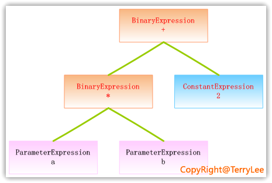

这里每一个节点都表示一个表达式，可能是一个二元运算，也可能是一个常量或者参数等，如上图中的ParameterExpression就是一个参数表达式，ConstantExpression是一个常量表达式，BinaryExpression是一个二元表达式。我们也可以在Visual Studio中使用Expression Tree Visualizer来查看该表达式目录树：

.NET Framework到底提供的表达式类型：

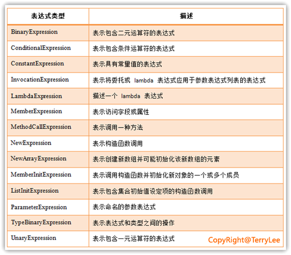

它们都继承于抽象的基类Expression，而泛型的Expression<TDelegate>则继承于LambdaExpression。在Expression类中提供了大量的工厂方法，这些方法负责创建以上各种表达式对象，如调用Add()方法将创建一个表示不进行溢出检查的算术加法运算的BinaryExpression对象，调用Lambda方法将创建一个表示lambda 表达式的LambdaExpression对象，具体提供的方法大家可以查阅MSDN。上面构造表达式目录树时我们使用了Lambda表达式，现在我们看一下如何通过这些表达式对象手工构造出一个表达式目录树，如下代码所示：

```C#
static void Main(string[] args)
{
    ParameterExpression paraLeft = Expression.Parameter(typeof(int), "a");
    ParameterExpression paraRight = Expression.Parameter(typeof(int), "b");

    BinaryExpression binaryLeft = Expression.Multiply(paraLeft, paraRight);
    ConstantExpression conRight = Expression.Constant(2, typeof(int));

    BinaryExpression binaryBody = Expression.Add(binaryLeft, conRight);

    LambdaExpression lambda = 
        Expression.Lambda<Func<int, int, int>>(binaryBody, paraLeft, paraRight);

    Console.WriteLine(lambda.ToString());

    Console.Read();
}
```

对于一个表达式目录树来说，它有几个比较重要的属性：

- Body：指表达式的主体部分；
- Parameters：指表达式的参数；
- NodeType：指表达式的节点类型，如在上面的例子中，它的节点类型是Lambda；
- Type：指表达式的静态类型，在上面的例子中，Type为Fun<int,int,int>。

## 表达式目录树与委托

大家可能经常看到如下这样的语言，其中第一句是直接用Lambda表达式来初始化了Func委托，而第二句则使用Lambda表达式来构造了一个表达式目录树，它们之间的区别是什么呢？

```C#
static void Main(string[] args)
{
    Func<int, int, int> lambda = (a, b) => a + b * 2;

    Expression<Func<int, int, int>> expression = (a, b) => a + b * 2;
} 
```

其实看一下IL就很明显，其中第一句直接将Lambda表达式直接编译成了IL，如下代码所示：

```IL
.method private hidebysig static void  Main(string[] args) cil managed
{
  .entrypoint
  .maxstack  3
  .locals init ([0] class [System.Core]System.Func`3<int32,int32,int32> lambda)
  IL_0000:  nop
  IL_0001:  ldsfld     class [System.Core]System.Func`3<int32,int32,int32> 
                        TerryLee.LinqToLiveSearch.Program::'CS$<>9__CachedAnonymousMethodDelegate1'
  IL_0006:  brtrue.s   IL_001b
  IL_0008:  ldnull
  IL_0009:  ldftn      int32 TerryLee.LinqToLiveSearch.Program::'<Main>b__0'(int32,
                                                                             int32)
  IL_000f:  newobj     instance void class [System.Core]System.Func`3<int32,int32,int32>::.ctor(object,
                                                                                                native int)
  IL_0014:  stsfld     class [System.Core]System.Func`3<int32,int32,int32> 
                    TerryLee.LinqToLiveSearch.Program::'CS$<>9__CachedAnonymousMethodDelegate1'
  IL_0019:  br.s       IL_001b
  IL_001b:  ldsfld     class [System.Core]System.Func`3<int32,int32,int32> 
                    TerryLee.LinqToLiveSearch.Program::'CS$<>9__CachedAnonymousMethodDelegate1'
  IL_0020:  stloc.0
  IL_0021:  ret
}

```

而第二句，由于告诉编译器是一个表达式目录树，所以编译器会分析该Lambda表达式，并生成表示该Lambda表达式的表达式目录树，即它与我们手工创建表达式目录树所生成的IL是一致的，如下代码所示，此处为了节省空间省略掉了部分代码：

```IL
.method private hidebysig static void  Main(string[] args) cil managed
{
  .entrypoint
  .maxstack  4
  .locals init ([0] class [System.Core]System.Linq.Expressions.Expression`1<
                class [System.Core]System.Func`3<int32,int32,int32>> expression,
           [1] class [System.Core]System.Linq.Expressions.ParameterExpression CS$0$0000,
           [2] class [System.Core]System.Linq.Expressions.ParameterExpression CS$0$0001,
           [3] class [System.Core]System.Linq.Expressions.ParameterExpression[] CS$0$0002)
  IL_0000:  nop
  IL_0001:  ldtoken    [mscorlib]System.Int32
  IL_0006:  call       class [mscorlib]System.Type [mscorlib]System.Type::GetTypeFromHandle(...)
  IL_000b:  ldstr      "a"
  IL_0010:  call       class [System.Core]System.Linq.Expressions.ParameterExpression 
                        [System.Core]System.Linq.Expressions.Expression::Parameter(
                        class [mscorlib]System.Type,

  IL_0038:  call    class [mscorlib]System.Type [mscorlib]System.Type::GetTypeFromHandle()
  IL_003d:  call    class [System.Core]System.Linq.Expressions.ConstantExpression 
                    [System.Core]System.Linq.Expressions.Expression::Constant(object,
                    class [mscorlib]System.Type)
  IL_0042:  call    class [System.Core]System.Linq.Expressions.BinaryExpression 
                    [System.Core]System.Linq.Expressions.Expression::Multiply(class [System.Core]System.Linq.Expressions.Expression,
                    class [System.Core]System.Linq.Expressions.Expression)
  IL_0047:  call    class [System.Core]System.Linq.Expressions.BinaryExpression
                    [System.Core]System.Linq.Expressions.Expression::Add(class [System.Core]System.Linq.Expressions.Expression,
                    class [System.Core]System.Linq.Expressions.Expression)
  IL_004c:  ldc.i4.2
  IL_004d:  newarr     [System.Core]System.Linq.Expressions.ParameterExpression
}
```

现在相信大家都看明白了，这里讲解它们的区别主要是为了加深大家对于表达式目录树的区别。

## 执行表达式目录树

前面已经可以构造出一个表达式目录树了，现在看看如何去执行表达式目录树。我们需要调用Compile方法来创建一个可执行委托，并且调用该委托，如下面的代码：

```C#
static void Main(string[] args)
{
    ParameterExpression paraLeft = Expression.Parameter(typeof(int), "a");
    ParameterExpression paraRight = Expression.Parameter(typeof(int), "b");

    BinaryExpression binaryLeft = Expression.Multiply(paraLeft, paraRight);
    ConstantExpression conRight = Expression.Constant(2, typeof(int));

    BinaryExpression binaryBody = Expression.Add(binaryLeft, conRight);

    Expression<Func<int, int, int>> lambda = 
        Expression.Lambda<Func<int, int, int>>(binaryBody, paraLeft, paraRight);

    Func<int, int, int> myLambda = lambda.Compile();

    int result = myLambda(2, 3);
    Console.WriteLine("result:" + result.ToString());

    Console.Read();
}
```

运行后输出的结果：

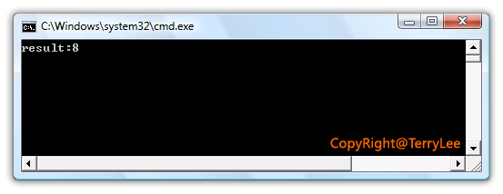

这里我们只要简单的调用Compile方法就可以了，事实上在.NET Framework中是调用了一个名为ExpressionCompiler的内部类来做表达式目录树的执行（注意此处的Compiler不等同于编译器的编译）。另外，只能执行表示Lambda表达式的表达式目录树，即LambdaExpression或者Expression&lt;TDelegate&gt;类型。如果表达式目录树不是表示Lambda表达式，需要调用Lambda方法创建一个新的表达式。如下面的代码：

```C#
static void Main(string[] args)
{
    BinaryExpression body = Expression.Add(
        Expression.Constant(2),
        Expression.Constant(3));

    Expression<Func<int>> expression = 
        Expression.Lambda<Func<int>>(body, null);

    Func<int> lambda = expression.Compile();

    Console.WriteLine(lambda());
}
```

## 访问与修改表达式目录树

在.NET Framework中，提供了一个抽象的表达式目录树访问类ExpressionVisitor，但它是一个internal的，我们不能直接访问。幸运的是，在MSDN中微软给出了ExpressionVisitor类的实现，我们可以直接拿来使用。该类是一个抽象类，微软旨在让我们在集成ExpressionVisitor的基础上，实现自己的表达式目录树访问类。现在我们来看简单的表达式目录树：

```C#
static void Main(string[] args)
{
    Expression<Func<int, int, int>> lambda = (a, b) => a + b * 2;

    Console.WriteLine(lambda.ToString());
} 
```

输出后为：

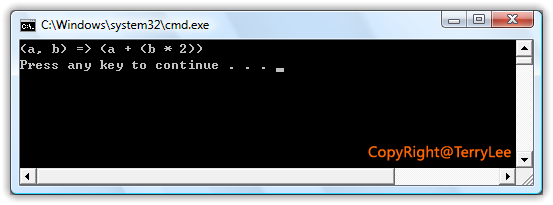

现在我们想要修改表达式目录树，让它表示的Lambda表达式为(a,b)=>(a - (b * 2))，这时就需要编写自己的表达式目录树访问器，如下代码所示：

```C#
public class OperationsVisitor : ExpressionVisitor
{
    public Expression Modify(Expression expression)
    {
        return Visit(expression);
    }

    protected override Expression VisitBinary(BinaryExpression b)
    {
        if (b.NodeType == ExpressionType.Add)
        {
            Expression left = this.Visit(b.Left);
            Expression right = this.Visit(b.Right);
            return Expression.Subtract(left,right);
        }

        return base.VisitBinary(b);
    }
}
```

使用表达式目录树访问器来修改表达式目录树，如下代码所示：

```C#
static void Main(string[] args)
{
    Expression<Func<int, int, int>> lambda = (a, b) => a + b * 2;

    var operationsVisitor = new OperationsVisitor();
    Expression modifyExpression = operationsVisitor.Modify(lambda);

    Console.WriteLine(modifyExpression.ToString());
}
```

结果如下：

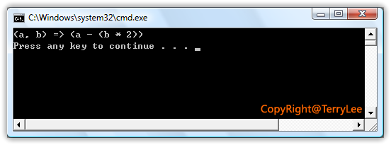

似乎我们是修改表达式目录树，其实也不全对，我们只是修改表达式目录树的一个副本而已，因为表达式目录树是不可变的，我们不能直接修改表达式目录树，看看上面的OperationsVisitor类的实现大家就知道了，在修改过程中复制了表达式目录树的节点。

## 为什么需要表达式目录树

就拿LINQ to SQL为例

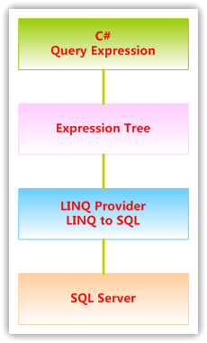

当我们在C#语言中编写一个查询表达式时，它将返回一个IQueryable类型的值，在该类型中包含了两个很重要的属性Expression和Provider，如下面的代码：

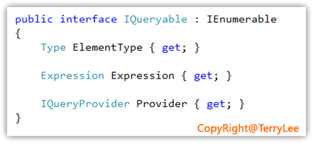

我们编写的查询表达式，将封装为一种抽象的数据结构，这个数据结构就是表达式目录树，当我们在使用上面返回的值时，编译器将会以该值所期望的方式进行翻译，这种方式就是由Expression和Provider来决定。可以看到，这样将会非常的灵活且具有良好的可扩展性，有了表达式目录树，可以自由的编写自己的Provider，去查询我们希望的数据源。经常说LINQ为访问各种不同的数据源提供了一种统一的编程方式，其奥秘就在这里。然而需要注意的是LINQ to Objects并不需要任何特定的LINQ Provider，因为它并不翻译为表达式目录树，后面会说到这一点。

## IEnumerable&lt;T&gt;接口

```C#
static void Main(string[] args)
{
    List<String> myList = new List<String>() { "a", "ab", "cd", "bd" };

    IEnumerable<String> query = from s in myList
                where s.StartsWith("a")
                select s;

    foreach (String s in query)
    {
        Console.WriteLine(s);
    }

    Console.Read();
}
```

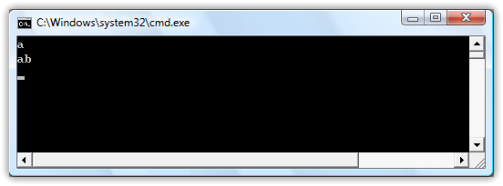

为什么在LINQ to Objects中返回的是IEnumerable<T>类型的数据而不是IQueryable<T>呢？
在LINQ to Objects中查询表达式或者Lambda表达式并不翻译为表达式目录树，因为LINQ to Objects查询的都是实现了IEnmerable<T>接口的数据，所以查询表达式或者Lambda表达式都可以直接转换为.NET代码来执行，无需再经过转换为表达式目录这一步，这也是LINQ to Objects比较特殊的地方，它不需要特定的LINQ Provider。我们可以看一下IEnumerable<T>接口的实现，它里面并没有Expression和Provider这样的属性，如下图所示：

```C#
public interface IEnumerable<T>:Ienumerable
{
    IEnumerator<T> GetEnumerator();
}
```

至于LINQ to Objects中所有的标准查询操作符都是通过扩展方法来实现的，它们在抽象类Enumerable中定义，如其中的Where扩展方法如下代码所示：

```C#
public static class Enumerable
{
    public static IEnumerable<TSource> Where<TSource>(
        this IEnumerable<TSource> source, 
        Func<TSource, bool> predicate)
    {
        if (source == null)
        {
            throw Error.ArgumentNull("source");
        }
        if (predicate == null)
        {
            throw Error.ArgumentNull("predicate");
        }
        return WhereIterator<TSource>(source, predicate);
    }

    public static IEnumerable<TSource> Where<TSource>(
        this IEnumerable<TSource> source, 
        Func<TSource, int, bool> predicate)
    {
        if (source == null)
        {
            throw Error.ArgumentNull("source");
        }
        if (predicate == null)
        {
            throw Error.ArgumentNull("predicate");
        }
        return WhereIterator<TSource>(source, predicate);
    }
}
```

注意到这里方法的参数Func<TSource>系列委托，而非Expression<Func<TSource>>，在本文的后面，你将看到，IQueryable接口的数据，这些扩展方法的参数都是Expression<Func<TSource>>.

同样还有一点需要说明的是，在IEnumerable<T>中提供了一组扩展方法AsQueryable()，可以用来把一个IEnumerable<T>类型的数据转换为IQueryable<T>类型，如下代码所示：

```C#
static void Main(string[] args)
{
    var myList = new List<String>() 
                { "a", "ab", "cd", "bd" }.AsQueryable<String>();

    IQueryable<String> query = from s in myList
                where s.StartsWith("a")
                select s;

    foreach (String s in query)
    {
        Console.WriteLine(s);
    }

    Console.Read();
} 
```

运行这段代码，虽然它的输出结果与上面的示例完全相同，但它们查询的机制却完全不同：

## IQueryable&lt;T&gt;接口

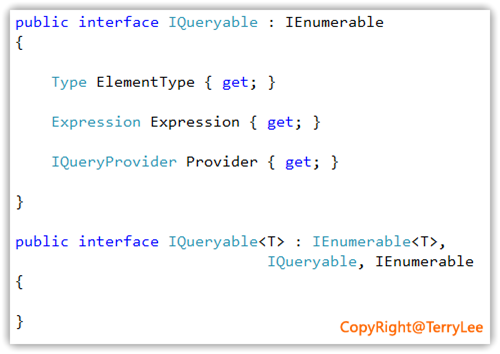

这里有两个很重要的属性Expression和Provider，分别表示获取与IQueryable 的实例关联的表达式目录树和获取与此数据源关联的查询提供程序，我们所有定义在查询表达式中方法调用或者Lambda表达式都将由该Expression属性表示，而最终会由Provider表示的提供程序翻译为它所对应的数据源的查询语言，这个数据源可能是数据库，XML文件或者是WebService等。该接口非常重要，在我们自定义LINQ Provider中必须要实现这个接口。同样对于IQueryable的标准查询操作都是由Queryable中的扩展方法来实现的，如下代码所示：

```C#
public static class Queryable
{
    public static IQueryable<TSource> Where<TSource>(this IQueryable<TSource> source, 
            Expression<Func<TSource, bool>> predicate)
    {
        if (source == null)
        {
            throw Error.ArgumentNull("source");
        }
        if (predicate == null)
        {
            throw Error.ArgumentNull("predicate");
        }
        return source.Provider.CreateQuery<TSource>(
            Expression.Call(null, ((MethodInfo) MethodBase.GetCurrentMethod())
            .MakeGenericMethod(new Type[] { typeof(TSource) }), 
            new Expression[] { source.Expression, Expression.Quote(predicate) }));
    }

    public static IQueryable<TSource> Where<TSource>(this IQueryable<TSource> source,
        Expression<Func<TSource, int, bool>> predicate)
    {
        if (source == null)
        {
            throw Error.ArgumentNull("source");
        }
        if (predicate == null)
        {
            throw Error.ArgumentNull("predicate");
        }
        return source.Provider.CreateQuery<TSource>(
            Expression.Call(null, ((MethodInfo) MethodBase.GetCurrentMethod())
            .MakeGenericMethod(new Type[] { typeof(TSource) }), 
            new Expression[] { source.Expression, Expression.Quote(predicate) }));
    }
}
```

最后还有一点，如果我们定义的查询需要支持Orderby等操作，还必须实现IOrderedQueryable&lt;T&gt; 接口，它继承自IQueryable&lt;T&gt;，如下图所示：

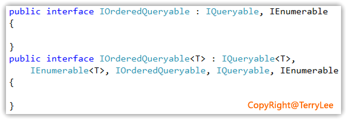

## IQueryProvider接口

在认识了IQueryable接口之后，我们再来看看在自定义LINQ Provider中另一个非常重要的接口IQueryProvider。它的定义如下图所示：

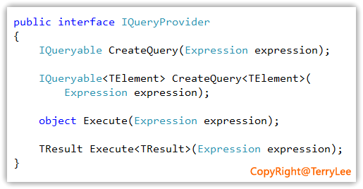

看到这里两组方法的参数，其实大家已经可以知道，Provider负责执行表达式目录树并返回结果。如果是LINQ to SQL的Provider，则它会负责把表达式目录树翻译为T-SQL语句并并传递给数据库服务器，并返回最后的执行的结果；如果是一个Web Service的Provider，则它会负责翻译表达式目录树并调用Web Service，最终返回结果。
这里四个方法其实就两个操作CreateQuery和Execute（分别有泛型和非泛型），CreateQuery方法用于构造一个 IQueryable<T> 对象，该对象可计算指定表达式目录树所表示的查询，返回的结果是一个可枚举的类型，；而Execute执行指定表达式目录树所表示的查询，返回的结果是一个单一值。自定义一个最简单的LINQ Provider，至少需要实现IQueryable<T>和IQueryProvider两个接口，在下篇文章中，你将看到一个综合的实例。

## 扩展LINQ的两种方式

通过前面的讲解，我们可以想到，对于LINQ的扩展有两种方式，一是借助于LINQ to Objects，如果我们所做的查询直接在.NET代码中执行，就可以实现IEnumerable<T>接口，而无须再去实现IQueryable并编写自定义的LINQ Provider，如.NET中内置的List<T>等。如我们可以编写一段简单自定义代码：

```C#
public class MyData<T> : IEnumerable<T>
                where T : class
{
    public IEnumerator<T> GetEnumerator()
    {
        return null;
    }

    IEnumerator IEnumerable.GetEnumerator()
    {
        return null;
    }

    // 其它成员
}
```

第二种扩展LINQ的方式当然就是自定义LINQ Provider了，我们需要实现IQueryable<T>和IQueryProvider两个接口，下面先给出一段简单的示意代码，在下一篇中我们将完整的来实现一个LINQ Provider。如下代码所示：

```C#
public class QueryableData<TData> : IQueryable<TData>
{
    public QueryableData()
    {
        Provider = new TerryQueryProvider();
        Expression = Expression.Constant(this);
    }

    public QueryableData(TerryQueryProvider provider, 
        Expression expression)
    {
        if (provider == null)
        {
            throw new ArgumentNullException("provider");
        }

        if (expression == null)
        {
            throw new ArgumentNullException("expression");
        }

        if (!typeof(IQueryable<TData>).IsAssignableFrom(expression.Type))
        {
            throw new ArgumentOutOfRangeException("expression");
        }

        Provider = provider;
        Expression = expression;
    }

    public IQueryProvider Provider { get; private set; }
    public Expression Expression { get; private set; }

    public Type ElementType
    {
        get { return typeof(TData); }
    }

    public IEnumerator<TData> GetEnumerator()
    {
        return (Provider.Execute<IEnumerable<TData>>(Expression)).GetEnumerator();
    }

    IEnumerator IEnumerable.GetEnumerator()
    {
        return (Provider.Execute<IEnumerable>(Expression)).GetEnumerator();
    }
}

public class TerryQueryProvider : IQueryProvider
{
    public IQueryable CreateQuery(Expression expression)
    {
        Type elementType = TypeSystem.GetElementType(expression.Type);
        try
        {
            return (IQueryable)Activator.CreateInstance(
                typeof(QueryableData<>).MakeGenericType(elementType),
                new object[] { this, expression });
        }
        catch
        {
            throw new Exception();
        }
    }

    public IQueryable<TResult> CreateQuery<TResult>(Expression expression)
    {
        return new QueryableData<TResult>(this, expression);
    }

    public object Execute(Expression expression)
    {
        // ......
    }

    public TResult Execute<TResult>(Expression expression)
    {
        // ......
    }
}
```

上面这两个接口都没有完成，这里只是示意性的代码，如果实现了这两个接口，我们就可以像下面这样使用了（当然这样的使用是没有意义的，这里只是为了演示）：

```C#
static void Main(string[] args)
{
    QueryableData<String> mydata = new QueryableData<String> { 
        "TerryLee",
        "Cnblogs",
        "Dingxue"
    };

    var result = from d in mydata
                 select d;
    foreach (String item in result)
    {
        Console.WriteLine(item);
    }
}
```

现在再来分析一下这个执行过程，首先是实例化QueryableData<String>，同时也会实例化TerryQueryProvider；当执行查询表达式的时候，会调用TerryQueryProvider中的CreateQuery方法，来构造表达式目录树，此时查询并不会被真正执行（即延迟加载），只有当我们调用GetEnumerator方法，上例中的foreach，此时会调用TerryQueryProvider中的Execute方法，此时查询才会被真正执行，如下图所示：

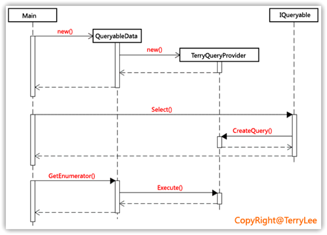