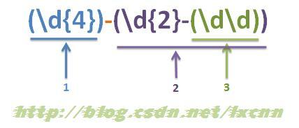
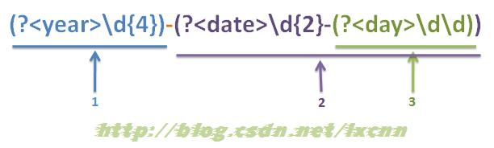
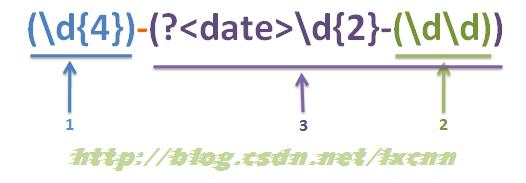

# 1. 常用正则表达式

## 1.1. 校验数字的表达式

```javascript
1. 数字 ：^[0-9]*$
2. n位的数字：^\d{n}$
3. 至少n位的数字：^\d{n,}$
4. m-n位的数字：^\d{m,n}$
5. 零和非零开头的数字：^(0|[1-9][0-9]*)$
6. 非零开头的最多带两位小数的数字：^([1-9][0-9]*)+(.[0-9]{1,2})?$
7. 带1-2位小数的正数或负数：^(-)?\d+(.\d{1,2})?$
8. 正数、负数、和小数：^(-|+)?\d+(.\d+)?$
9. 有两位小数的正实数：^[0-9]+(.[0-9]{2})?$
10. 有1~3位小数的正实数：^[0-9]+(.[0-9]{1,3})?$
11. 非零的正整数：^[1-9]\d$ 或 ^([1-9][0-9]){1,3}$ 或 ^+?[1-9][0-9]*$
12. 非零的负整数：^-[1-9][]0-9"$ 或 ^-[1-9]\d$
13. 非负整数：^\d+$ 或 ^[1-9]\d*|0$
14. 非正整数：^-[1-9]\d*|0$ 或 ^((-\d+)|(0+))$
15. 非负浮点数：^\d+(.\d+)?$ 或 ^[1-9]\d.\d|0.\d[1-9]\d|0?.0+|0$
16. 非正浮点数：^((-\d+(.\d+)?)|(0+(.0+)?))$ 或 ^(-([1-9]\d.\d|0.\d[1-9]\d))|0?.0+|0$
17. 正浮点数：^[1-9]\d.\d|0.\d[1-9]\d$ 或 ^(([0-9]+.[0-9][1-9][0-9])|([0-9][1-9][0-9].[0-9]+)|([0-9][1-9][0-9]))$
18. 负浮点数：^-([1-9]\d.\d|0.\d[1-9]\d)$ 或 ^(-(([0-9]+.[0-9][1-9][0-9])|([0-9][1-9][0-9].[0-9]+)|([0-9][1-9][0-9])))$
19. 浮点数：^(-?\d+)(.\d+)?$ 或 ^-?([1-9]\d.\d|0.\d[1-9]\d|0?.0+|0)$
```

## 1.2. 校验字符的表达式

```javascript
1. 汉字：^[\u4e00-\u9fa5]{0,}$
2. 英文和数字：^[A-Za-z0-9]+$ 或 ^[A-Za-z0-9]{4,40}$
3. 长度为3-20的所有字符：^.{3,20}$
4. 由26个英文字母组成的字符串：^[A-Za-z]+$
5. 由26个大写英文字母组成的字符串：^[A-Z]+$
6. 由26个小写英文字母组成的字符串：^[a-z]+$
7. 由数字和26个英文字母组成的字符串：^[A-Za-z0-9]+$
8. 由数字、26个英文字母或者下划线组成的字符串：^\w+$ 或 ^\w{3,20}$
9. 中文、英文、数字包括下划线：^[\u4E00-\u9FA5A-Za-z0-9_]+$
10. 中文、英文、数字但不包括下划线等符号：^[\u4E00-\u9FA5A-Za-z0-9]+$ 或 ^[\u4E00-\u9FA5A-Za-z0-9]{2,20}$
11. 可以输入含有^%&',;=?$\"等字符：[^%&',;=?$\x22]+
12. 禁止输入含有~的字符：[^~\x22]+
```

## 1.3. 特殊需求表达式
```javascript
1. Email地址：^\w+([-+.]\w+)@\w+([-.]\w+).\w+([-.]\w+)*$
2. 域名：[a-zA-Z0-9][-a-zA-Z0-9]{0,62}(/.[a-zA-Z0-9][-a-zA-Z0-9]{0,62})+/.?
3. InternetURL：[a-zA-z]+://[^\s] 或 ^http://([\w-]+\.)+[\w-]+(/[\w-./?%&=])?$
4. 手机号码：^(13[0-9]|14[5|7]|15[0|1|2|3|5|6|7|8|9]|18[0|1|2|3|5|6|7|8|9])\d{8}$
5. 电话号码("XXX-XXXXXXX"、"XXXX-XXXXXXXX"、"XXX-XXXXXXX"、"XXX-XXXXXXXX"、"XXXXXXX"和"XXXXXXXX)：^((\d{3,4}-)|\d{3.4}-)?\d{7,8}$
6. 国内电话号码(0511-4405222、021-87888822)：\d{3}-\d{8}|\d{4}-\d{7}
7. 身份证号(15位、18位数字)：^\d{15}|\d{18}$
8. 短身份证号码(数字、字母x结尾)：^([0-9]){7,18}(x|X)?$ 或 ^\d{8,18}|[0-9x]{8,18}|[0-9X]{8,18}?$
9. 帐号是否合法(字母开头，允许5-16字节，允许字母数字下划线)：^[a-zA-Z][a-zA-Z0-9_]{4,15}$
10. 密码(以字母开头，长度在6~18之间，只能包含字母、数字和下划线)：^[a-zA-Z]\w{5,17}$
11. 强密码(必须包含大小写字母和数字的组合，不能使用特殊字符，长度在8-10之间)：^(?=.\d)(?=.[a-z])(?=.*[A-Z]).{8,10}$
12. 日期格式：^\d{4}-\d{1,2}-\d{1,2}
13. 一年的12个月(01～09和1～12)：^(0?[1-9]|1[0-2])$
14. 一个月的31天(01～09和1～31)：^((0?[1-9])|((1|2)[0-9])|30|31)$
15. 钱的输入格式：有四种钱的表示形式我们可以接受:
- "10000.00" 和 "10,000.00", 和没有 "分" 的 "10000" 和 "10,000"：^[1-9][0-9]*$
- 这表示任意一个不以0开头的数字,但是,这也意味着一个字符"0"不通过,所以我们采用下面的形式：^(0|[1-9][0-9]*)$
- 一个0或者一个不以0开头的数字.我们还可以允许开头有一个负号：^(0|-?[1-9][0-9]*)$
- 这表示一个0或者一个可能为负的开头不为0的数字.让用户以0开头好了.把负号的也去掉,因为钱总不能是负的吧.下面我们要加的是说明可能的小数部分：^[0-9]+(.[0-9]+)?$
- 必须说明的是,小数点后面至少应该有1位数,所以"10."是不通过的,但是 "10" 和 "10.2" 是通过的：^[0-9]+(.[0-9]{2})?$
- 这样我们规定小数点后面必须有两位,如果你认为太苛刻了,可以这样：^[0-9]+(.[0-9]{1,2})?$
- 这样就允许用户只写一位小数.下面我们该考虑数字中的逗号了,我们可以这样：^[0-9]{1,3}(,[0-9]{3})*(.[0-9]{1,2})?$
- 1到3个数字,后面跟着任意个 逗号+3个数字,逗号成为可选,而不是必须：^([0-9]+|[0-9]{1,3}(,[0-9]{3})*)(.[0-9]{1,2})?$
备注：这就是最终结果了,别忘了"+"可以用"*"替代如果你觉得空字符串也可以接受的话(奇怪,为什么?)最后,别忘了在用函数时去掉去掉那个反斜杠,一般的错误都在这里
25. xml文件：^([a-zA-Z]+-?)+[a-zA-Z0-9]+\.[x|X][m|M][l|L]$
26. 中文字符的正则表达式：[\u4e00-\u9fa5]
27. 双字节字符：[^\x00-\xff] (包括汉字在内，可以用来计算字符串的长度(一个双字节字符长度计2，ASCII字符计1))
28. 空白行的正则表达式：\n\s*\r (可以用来删除空白行)
29. HTML标记的正则表达式：<(\S?)[^>]>.?</\1>|<.? /> (网上流传的版本太糟糕，上面这个也仅仅能部分，对于复杂的嵌套标记依旧无能为力)
30. 首尾空白字符的正则表达式：^\s|\s$或(^\s)|(\s$) (可以用来删除行首行尾的空白字符(包括空格、制表符、换页符等等)，非常有用的表达式)
31. 腾讯QQ号：[1-9][0-9]{4,} (腾讯QQ号从10000开始)
32. 中国邮政编码：[1-9]\d{5}(?!\d) (中国邮政编码为6位数字)
33. IP地址：\d+.\d+.\d+.\d+ (提取IP地址时有用)
34. IP地址：((?:(?:25[0-5]|2[0-4]\d|[01]?\d?\d)\.){3}(?:25[0-5]|2[0-4]\d|[01]?\d?\d))
```


# 2. 正则表达式捕获组

## 2.1. 什么是捕获组

捕获组就是把正则表达式中子表达式匹配的内容，保存到内存中以数字编号或显式命名的组里，方便后面引用。当然，这种引用既可以是在正则表达式内部，也可以是在正则表达式外部。

## 2.2. 捕获组的种形式

普通捕获组：(Expression)
命名捕获组：(?&lt;name>Expression)，注：.NET中使用(?’name’Expression)与使用(?&lt;name>Expression)是等价的

## 2.3. 捕获组编号规则

- 普通捕获组编号规则



- 命名捕获组编号规则



- 普通与命名混合



## 2.4. 捕获组的引用

### 2.4.1. 反向引用

正则表达式中，对前面捕获组捕获的内容进行引用，称为反向引用；

### 2.4.2. 在程序中引用

#### 2.4.2.1. 在javascript中的引用

1 由于JavaScript中不支持命名捕获组，所以对于捕获组的引用就只支持普通捕获组的反向引用和$number方式的引用。程序中的引用一般在替换和匹配时使用。
举例：替换掉html标签中的属性。

````javascript
<textarea id="result" rows="10" cols="100"></textarea> 
<script type="text/javascript"> 
var data = "<table id=\"test\"><tr class=\"light\"><td> test </td></tr></table>";
var reg = /<([a-z]+)[^>]*>/ig;
document.getElementById("result").value = data.replace(reg, "<$1>");
</script>
````

//输出

````javascript
<table><tr><td> test </td></tr></table>
````

2 在匹配时的引用，通常通过RegExp.$number方式引用。

举例：同时获取&lt;img…>中的src和name属性值，属性的顺序不固定。参考 一条正则能不能同时取出一个img标记的src和name?

````html
<textarea id="result" rows="10" cols="100"></textarea>
<script type="text/javascript">
var data = [' ', ' '] ;  
var reg = /]+)\1)(?:(?!src=).)*src=(['"]?)([^'"\s>]+)\3[^>]*>/i;
for(var i=0;i<data.length;i++)
{
    var s = data[i];
    document.getElementById("result").value += "源字符串：" + s + "\n";
    document.write("<br />");
    if(reg.test(s))
    {
        document.getElementById("result").value += "name: " + RegExp.$2 + "\n";
        document.getElementById("result").value += "src: " + RegExp.$4 + "\n";
    }
}
</script>
````

#### 2.4.2.2. 在.net中的引用

由于.NET支持命名捕获组，所以在.NET中的引用方式会多一些。通常也是在两种场景下应用，一是替换，一是匹配。

1 替换中的引用
普通捕获组：$number
命名捕获组：${name}
替换中应用，仍是上面的例子。
举例：替换掉html标签中的属性。使用普通捕获组。

```C#
string data = "<table id=\"test\"><tr class=\"light\"><td> test </td></tr></table>";
richTextBox2.Text = Regex.Replace(data, @"(?i)<([a-z]+)[^>]*>", "<$1>");
//输出  <table><tr><td> test </td></tr></table>
使用命名捕获组。
string data = "<table id=\"test\"><tr class=\"light\"><td> test </td></tr></table>";
richTextBox2.Text = Regex.Replace(data, @"(?i)<(?<tag>[a-z]+)[^>]*>", "<${tag}>");
//输出  <table><tr><td> test </td></tr></table>
````

2 匹配后的引用
对于匹配结果中捕获组捕获内容的引用，可以通过Groups和Result对象进行引用。

````C#
string test = "<a href=\"http://www.csdn.NET\">CSDN</a>";
Regex reg = new Regex(@"(?is)<a(?:(?!href=).)*href=(['""]?)(?<url>[^""'\s>]*)\1[^>]*>(?<text>(?:(?!</a>).)*)</a>");
MatchCollection mc = reg.Matches(test);
foreach (Match m in mc)
{
     richTextBox2.Text += "m.Value：".PadRight(25) + m.Value + "\n";
     richTextBox2.Text += "m.Result(\"$0\")：".PadRight(25) + m.Result("$0") + "\n";
     richTextBox2.Text += "m.Groups[0].Value：".PadRight(25) + m.Groups[0].Value + "\n";
     richTextBox2.Text += "m.Result(\"$2\")：".PadRight(25) + m.Result("$2") + "\n";
     richTextBox2.Text += "m.Groups[2].Value：".PadRight(25) + m.Groups[2].Value + "\n";
     richTextBox2.Text += "m.Result(\"${url}\")：".PadRight(25) + m.Result("${url}") + "\n";     richTextBox2.Text += "m.Groups[\"url\"].Value：".PadRight(25) + m.Groups["url"].Value + "\n";
     richTextBox2.Text += "m.Result(\"$3\")：".PadRight(25) + m.Result("$3") + "\n";
     richTextBox2.Text += "m.Groups[3].Value：".PadRight(25) + m.Groups[3].Value + "\n";
     richTextBox2.Text += "m.Result(\"${text}\")：".PadRight(25) + m.Result("${text}") + "\n";
     richTextBox2.Text += "m.Groups[\"text\"].Value：".PadRight(25) + m.Groups["text"].Value + "\n";
}
//输出
/*
m.Value：                 <a href="http://www.csdn.Net">CSDN</a>
m.Result("$0")：          <a href="http://www.csdn.net">CSDN</a>
m.Groups[0].Value：       <a href="http://www.csdn.net">CSDN</a>
m.Result("$2")：          http://www.csdn.net
m.Groups[2].Value：       http://www.csdn.net
m.Result("${url}")：      http://www.csdn.net
m.Groups["url"].Value：   http://www.csdn.net
m.Result("$3")：          CSDN
m.Groups[3].Value：       CSDN
m.Result("${text}")：     CSDN
m.Groups["text"].Value：  CSDN*/
````

对于捕获组0的引用，可以简写作m.Value。
